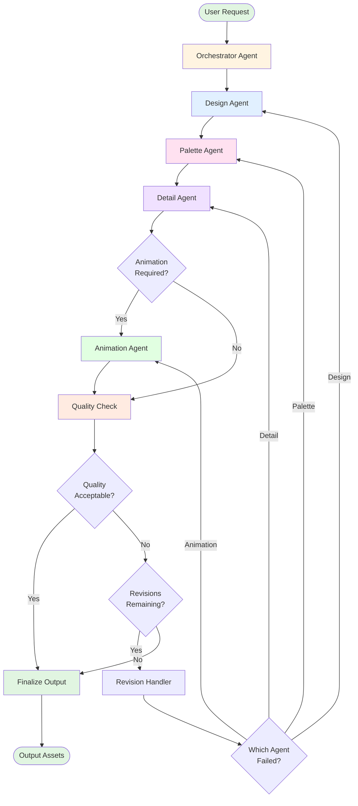

# Vision Multi-Agent System Implementation Roadmap

**Project**: Vision - AI-Powered Pixel Art Generation System  
**Architecture**: Multi-Agent Specialist System (Option 2)  
**Timeline**: 8-10 Weeks MVP Development  
**LLM Provider**: Claude Sonnet 4.5 (All Agents)  
**Last Updated**: 2025-11-17

---

## Executive Summary

This roadmap details the implementation of a sophisticated multi-agent system for automated pixel art generation. The system uses specialized LLM agents that collaborate through LangGraph orchestration to create high-quality pixel art assets including sprites, icons, characters, environments, and animations. The architecture prioritizes modularity, quality control, and scalability while maintaining cost efficiency through intelligent agent coordination.

**Key Capabilities**:
- Multi-specialist agent collaboration for pixel art creation
- Batch generation with texture atlas compilation
- Version-controlled asset management
- Roo integration for seamless workflow
- Quality assurance checkpoints at each stage
- Support for all pixel art types (sprites, icons, characters, environments, animations)

**Requirements Captured**:
- All pixel art types supported
- Claude Sonnet 4.5 for all agents
- Batch generation with texture atlas output
- No existing asset dependencies
- 8-10 week MVP timeline

---

## Table of Contents

1. [Phase Breakdown](#phase-breakdown)
2. [Agent Specifications](#agent-specifications)
3. [Technical Architecture](#technical-architecture)
4. [Infrastructure Requirements](#infrastructure-requirements)
5. [Integration Strategy](#integration-strategy)
6. [Risk Mitigation](#risk-mitigation)
7. [Success Metrics](#success-metrics)
8. [Appendices](#appendices)

---

## Phase Breakdown

### Phase 1: Foundation & Infrastructure (Weeks 1-2)

**Objective**: Establish the technical foundation for the multi-agent system.

#### Week 1: Core Infrastructure Setup

**Deliverables**:
- Development environment configuration
- LangGraph framework integration
- Redis state management setup
- Basic project structure and conventions
- CI/CD pipeline initialization

**Key Tasks**:

1. **Set up Python virtual environment with dependencies**:
   - LangGraph 0.2.x
   - LangChain 0.1.x
   - Anthropic SDK 0.30.x
   - Redis-py 5.x
   - Pillow for image processing
   - pytest for testing framework

2. **Configure Redis for state management**:
   - Design initial schema for agent states
   - Set up connection pooling
   - Implement serialization/deserialization utilities
   - Configure TTL policies for ephemeral data

3. **Create project structure**:
   ```
   vision/
   ├── agents/
   │   ├── __init__.py
   │   ├── base_agent.py
   │   ├── orchestrator/
   │   │   ├── __init__.py
   │   │   ├── agent.py
   │   │   └── prompts.py
   │   ├── design/
   │   ├── palette/
   │   ├── detail/
   │   └── animation/
   ├── core/
   │   ├── __init__.py
   │   ├── state_management.py
   │   ├── message_protocol.py
   │   └── types.py
   ├── workflows/
   │   ├── __init__.py
   │   └── langgraph_workflows.py
   ├── utils/
   │   ├── __init__.py
   │   ├── image_processing.py
   │   ├── manifest_renderer.py
   │   └── atlas_generator.py
   ├── tests/
   │   ├── unit/
   │   ├── integration/
   │   └── e2e/
   ├── config/
   │   ├── agent_prompts/
   │   └── settings.yaml
   ├── assets/
   │   └── generated/
   └── docs/
   ```

4. **Implement base classes and protocols**:
   - Abstract `BaseAgent` class with common functionality
   - `Message` protocol for inter-agent communication
   - `State` schema for workflow state management
   - `ValidationResult` types for quality checks

#### Week 2: Message Protocol & Basic Orchestration

**Deliverables**:
- Message passing protocol implementation
- Basic LangGraph workflow skeleton
- Orchestrator agent v0.1
- Unit test framework
- Documentation foundation

**Key Tasks**:

1. **Implement message protocol**:
   - Define Message dataclass with routing metadata
   - Create MessageBroker for agent communication
   - Implement message queuing in Redis
   - Add message logging and tracking

2. **Create LangGraph workflow structure**:
   - Define state graph nodes for each agent
   - Implement basic routing logic
   - Set up conditional edges
   - Add error handling nodes

3. **Build Orchestrator v0.1**:
   - Task decomposition logic
   - Agent assignment rules
   - Basic validation checks
   - Simple response aggregation

4. **Establish testing infrastructure**:
   - Unit tests for message protocol
   - Integration tests for state management
   - Mock agents for workflow testing
   - Test data generators for pixel art requests

**Success Criteria**:
- ✅ All infrastructure components installed and verified
- ✅ Redis successfully storing and retrieving state
- ✅ Messages can be sent between mock agents
- ✅ Basic workflow executes end-to-end
- ✅ >80% test coverage on core components

---

### Phase 2: Core Agent Development (Weeks 3-4)

**Objective**: Develop the four specialist agents with complete functionality.

#### Week 3: Design & Palette Agents

**Deliverables**:
- Design Agent v1.0 with full specifications
- Palette Agent v1.0 with color generation
- Agent-specific prompt engineering validated
- Integration tests for agent interactions

**Design Agent Development**:

1. **Implement core responsibilities**:
   - Parse natural language art requests
   - Generate structural layouts (composition, proportions)
   - Define shape primitives and spatial relationships
   - Output structured design specifications

2. **Create system prompt with pixel art expertise**:
   - Canvas dimension optimization (16x16 to 256x256)
   - Composition and visual hierarchy principles
   - Shape relationships and proportions
   - Style guidelines (retro, modern, isometric)

3. **Implement validation logic**:
   - Canvas size validation (reasonable dimensions)
   - Shape overlap detection
   - Composition balance checks
   - Style consistency verification

**Palette Agent Development**:

1. **Implement core responsibilities**:
   - Analyze design specifications for color needs
   - Generate color schemes appropriate for pixel art
   - Consider color count constraints (8-32 colors typical)
   - Create palette with semantic color roles

2. **Create system prompt with color theory**:
   - Limited color count optimization (8-32 colors)
   - Visual harmony and contrast principles
   - Retro vs modern palette characteristics
   - Color roles (primary, secondary, shadow, highlight, outline)

3. **Implement palette generation algorithms**:
   - Color harmony rules (complementary, triadic, etc.)
   - Automatic shadow/highlight generation
   - Dithering color suggestions
   - Palette optimization for visibility

#### Week 4: Detail & Animation Agents

**Deliverables**:
- Detail Agent v1.0 with Manifest JSON generation
- Animation Agent v1.0 with frame sequencing
- Complete agent test suite
- Agent performance benchmarks

**Detail Agent Development**:

1. **Implement core responsibilities**:
   - Transform design specs into pixel-level details
   - Generate Manifest JSON DSL representations
   - Apply palette colors to shapes
   - Add textures, shading, and fine details

2. **Create system prompt with pixel art techniques**:
   - Precise pixel placement for clean lines
   - Anti-aliasing techniques for curves
   - Shading and highlighting for depth
   - Texture application (solid, gradient, pattern)

3. **Implement detail enhancement algorithms**:
   - Edge smoothing for curved shapes
   - Shadow/highlight placement rules
   - Dithering patterns for gradients
   - Pixel-perfect alignment validation

**Animation Agent Development**:

1. **Implement core responsibilities**:
   - Create frame sequences for animations
   - Define timing and transitions
   - Ensure frame consistency
   - Generate animation metadata and sprite sheets

2. **Create system prompt with animation principles**:
   - Frame-by-frame consistency maintenance
   - Easing and timing principles
   - Sprite sheet organization
   - Loop optimization techniques

3. **Implement animation utilities**:
   - Frame interpolation helpers
   - Spritesheet packing algorithms
   - Animation preview generation
   - Timing validation

**Success Criteria**:
- ✅ All four agents operational independently
- ✅ Each agent passes unit and integration tests
- ✅ Agents produce valid, structured outputs
- ✅ Performance benchmarks meet targets (<10s per agent call)
- ✅ Prompt engineering validated through manual testing

---

### Phase 3: Agent Coordination & Workflow (Weeks 5-6)

**Objective**: Integrate agents into coordinated workflows with quality assurance.

#### Week 5: LangGraph Workflow Implementation

**Deliverables**:
- Complete LangGraph workflow graph
- State management integration
- Agent handoff protocols
- Workflow visualization tools

**Key Tasks**:

1. **Implement full workflow graph**:
   - Add all agent nodes to state graph
   - Define conditional routing logic
   - Implement error handling paths
   - Create revision loops

2. **Create comprehensive state management schema**:
   - Request tracking fields
   - Agent output storage
   - Quality validation results
   - Revision history
   - Metadata and timing information

3. **Implement agent handoff protocol**:
   - Pre-handoff validation
   - State serialization/deserialization
   - Context transfer between agents
   - Error propagation handling

4. **Build workflow monitoring**:
   - Real-time state logging
   - Agent execution tracking
   - Performance metrics collection
   - Workflow visualization (Mermaid diagrams)

#### Week 6: Quality Assurance & Revision System

**Deliverables**:
- Quality validation checkpoints at each stage
- Automated revision system with iteration limits
- Fallback mechanisms for failures
- Comprehensive error handling

**Key Tasks**:

1. **Implement quality validation node**:
   - Design spec validation (completeness, feasibility)
   - Palette validation (color harmony, count limits)
   - Detail validation (Manifest JSON validity, quality)
   - Animation validation (frame consistency, smoothness)

2. **Create revision system**:
   - Identify common failure patterns
   - Generate specific revision instructions
   - Limit revision attempts (max 2-3 per stage)
   - Escalate persistent failures to user

3. **Build fallback mechanisms**:
   - Default design templates for simple requests
   - Safe color palettes as backups
   - Simplified detail strategies
   - Graceful degradation for animations

4. **Implement comprehensive error handling**:
   - API rate limit handling with backoff
   - Timeout management with retries
   - Partial result recovery
   - Error logging and alerting

**Success Criteria**:
- ✅ Complete workflow executes end-to-end successfully
- ✅ Agents coordinate seamlessly through state
- ✅ Quality checks catch >90% of issues
- ✅ Revision system measurably improves output quality
- ✅ Error handling prevents system crashes

---

### Phase 4: Integration & Refinement (Weeks 7-8)

**Objective**: Integrate with Roo, add batch processing, and refine user experience.

#### Week 7: Roo Integration & GitHub Workflow

**Deliverables**:
- Roo mode for pixel art generation
- GitHub repository integration
- File organization system
- Version control workflow

**Key Tasks**:

1. **Create Roo mode configuration**:
   - Define mode prompts and behavior
   - Set up tool access (file operations, git commands)
   - Configure auto-approval settings
   - Establish naming conventions

2. **Implement GitHub integration**:
   - Automatic asset commits with descriptive messages
   - Branch management for asset batches
   - Pull request creation for review workflows
   - Commit message templates

3. **Build file organization system**:
   ```
   assets/
   ├── sprites/
   │   ├── characters/
   │   ├── items/
   │   └── effects/
   ├── icons/
   │   ├── ui/
   │   └── game/
   ├── environments/
   │   ├── tiles/
   │   └── backgrounds/
   ├── animations/
   │   ├── character_anims/
   │   └── effect_anims/
   └── atlases/
       ├── sprite_atlas_001.png
       ├── sprite_atlas_001.json
       └── README.md
   ```

4. **Create asset metadata system**:
   - JSON manifests for each asset
   - Asset catalog/index file
   - Search and filtering capabilities
   - Version history tracking

#### Week 8: Batch Processing & Texture Atlas Generation

**Deliverables**:
- Batch generation pipeline with parallel processing
- Texture atlas compiler with optimization
- Asset optimization tools
- Performance optimizations

**Key Tasks**:

1. **Implement batch processing**:
   - Parallel execution with rate limiting
   - Progress tracking and resumability
   - Result aggregation
   - Batch-wide quality validation

2. **Build texture atlas generator**:
   - Sprite packing algorithms (MaxRects, Shelf packing)
   - Atlas size optimization
   - JSON metadata generation (sprite positions, sizes)
   - Multiple atlas support for large batches
   - Export formats (PNG with JSON metadata)

3. **Create asset optimization**:
   - PNG optimization (pngquant/oxipng)
   - Palette reduction where appropriate
   - Metadata stripping for production builds
   - File size monitoring and reporting

4. **Optimize performance**:
   - Agent response caching for similar requests
   - State compression for large batches
   - Parallel agent execution (where possible)
   - Database query optimization

**Success Criteria**:
- ✅ Roo mode functions seamlessly with natural interaction
- ✅ Assets automatically committed to GitHub
- ✅ Batch processing handles 10+ assets reliably
- ✅ Texture atlases generated correctly with metadata
- ✅ Performance meets targets (see Success Metrics section)

---

### Phase 5: Testing, Optimization & Documentation (Weeks 9-10)

**Objective**: Comprehensive testing, performance tuning, and production readiness.

#### Week 9: Testing & Quality Assurance

**Deliverables**:
- Comprehensive test suite (unit, integration, e2e)
- Performance benchmarks and profiling
- User acceptance testing results
- Bug fixes and refinements

**Key Tasks**:

1. **Expand test coverage**:
   - Unit tests for all agent functions
   - Integration tests for workflows
   - End-to-end tests for complete generation
   - Edge case and error condition tests
   - Load testing for batch processing

2. **Conduct performance testing**:
   - Load testing (concurrent requests)
   - Stress testing (batch sizes up to 50+)
   - Latency profiling for each agent
   - Resource utilization monitoring

3. **User acceptance testing**:
   - Real-world art generation scenarios
   - Quality assessment of outputs by pixel art criteria
   - Usability evaluation of Roo interface
   - Feedback collection and iteration

4. **Bug fixing and refinement**:
   - Address all critical bugs
   - Optimize slow operations
   - Improve error messages for clarity
   - Enhance logging for debugging

#### Week 10: Documentation & Production Deployment

**Deliverables**:
- Complete documentation suite
- Deployment guides
- User tutorials and examples
- MVP release

**Key Tasks**:

1. **Create technical documentation**:
   - Architecture overview with diagrams
   - Agent specifications and system prompts
   - API documentation for extensibility
   - Configuration guides

2. **Write user documentation**:
   - Getting started guide
   - Usage examples for different art types
   - Best practices for prompt engineering
   - Troubleshooting guide

3. **Prepare deployment**:
   - Production environment setup
   - Environment variable configuration
   - Monitoring and alerting setup
   - Backup and recovery procedures

4. **Launch MVP**:
   - Final testing in production environment
   - Soft launch with limited test users
   - Monitor performance and issues
   - Gather initial feedback for iteration

**Success Criteria**:
- ✅ >90% test coverage achieved
- ✅ All performance targets met
- ✅ Documentation complete and clear
- ✅ MVP successfully deployed
- ✅ Initial users generating pixel art successfully

---

## Agent Specifications

This section provides detailed specifications for each agent in the multi-agent system, including their roles, responsibilities, input/output formats, system prompts, and success criteria.

### Orchestrator Agent

**Role**: Task Manager & Workflow Coordinator

**Core Responsibilities**:
1. Parse and analyze user requests for pixel art generation
2. Decompose complex requests into agent-specific tasks
3. Determine optimal agent execution sequence
4. Monitor workflow progress and handle coordination
5. Aggregate results and present final output
6. Handle errors and trigger revision workflows

**Input Format**:
```json
{
  "request": "Create a 32x32 pixel art character sprite for a fantasy RPG mage",
  "constraints": {
    "max_colors": 16,
    "style": "retro-8bit",
    "output_format": "png"
  },
  "batch_mode": false,
  "batch_items": [],
  "reference_images": []
}
```

**Output Format**:
```json
{
  "task_id": "uuid-string",
  "decomposition": {
    "agents_required": ["design", "palette", "detail"],
    "execution_order": ["design", "palette", "detail"],
    "estimated_time": 45,
    "requires_animation": false
  },
  "task_specs": {
    "design": {
      "objective": "Create structural layout for fantasy mage character",
      "constraints": {"canvas": "32x32", "style": "retro-8bit"}
    },
    "palette": {
      "objective": "Generate magical theme palette with max 16 colors",
      "constraints": {"max_colors": 16, "theme": "fantasy-magical"}
    },
    "detail": {
      "objective": "Render mage with robes, hat, and staff",
      "constraints": {"style": "retro-8bit"}
    }
  },
  "success_criteria": {
    "quality_threshold": 0.80,
    "max_revisions": 2
  }
}
```

**System Prompt**:
```
You are the Orchestrator Agent for a pixel art generation system. Your role is 
to analyze user requests and coordinate specialized agents to create high-quality 
pixel art assets.

Core Competencies:
1. Request Analysis: Understand user intent, extract requirements, identify constraints
2. Task Decomposition: Break complex requests into agent-specific subtasks
3. Workflow Planning: Determine optimal agent sequence and dependencies
4. Quality Oversight: Monitor outputs and trigger revisions when needed
5. Result Synthesis: Combine agent outputs into cohesive final assets

Decision Framework:
- For static images: Design → Palette → Detail
- For animations: Design → Palette → Detail → Animation
- For batch requests: Process each with same workflow, aggregate results
- For revisions: Identify failing agent, provide specific improvement guidance

Agent Selection Rules:
- Design Agent: Always required for structural planning
- Palette Agent: Always required for color scheme
- Detail Agent: Always required for pixel-level implementation
- Animation Agent: Only when animation explicitly requested or implied

Output Requirements:
- Clear, structured task specifications for each agent
- Realistic time estimates based on complexity
- Fallback strategies for failures
- Validation criteria for quality checks

Quality Standards:
- Prioritize quality over speed
- Be explicit in instructions to agents
- Include context from original request
- Specify pixel art constraints clearly

Always ensure task specifications are actionable and unambiguous.
```

**Communication Protocols**:
- **Receives**: Initial request from user/Roo interface
- **Sends to**: Task specifications to Design, Palette, Detail, Animation agents
- **Receives from**: Completed outputs from specialist agents
- **Sends**: Revision instructions when validation fails
- **Returns**: Final aggregated result to user/Roo

**Success Criteria**:
- Correctly decomposes >95% of requests into appropriate subtasks
- Optimal agent sequencing (no unnecessary agents called)
- Effective revision instructions (improve quality on retry)
- Clear, actionable error messages when failures occur

**Performance Targets**:
- Request analysis: <3 seconds
- Task decomposition: <2 seconds
- Result aggregation: <1 second

---

### Design Agent

**Role**: Structural Blueprint Creator

**Core Responsibilities**:
1. Analyze art request and translate to structural specifications
2. Determine optimal canvas dimensions for pixel art
3. Define composition, layout, and visual hierarchy
4. Generate shape primitives and spatial relationships
5. Create style guidelines for subsequent agents
6. Ensure design feasibility within pixel art constraints

**Input Format**:
```json
{
  "objective": "Create structural layout for fantasy mage character",
  "constraints": {
    "canvas": "32x32",
    "style": "retro-8bit",
    "subject_type": "character",
    "theme": "fantasy-magical"
  },
  "reference_context": "RPG character sprite, needs to be recognizable at small size"
}
```

**Output Format**:
```json
{
  "design_id": "uuid-string",
  "canvas": {
    "width": 32,
    "height": 32,
    "orientation": "square"
  },
  "style_guide": {
    "type": "retro-8bit",
    "reference_era": "NES/SNES",
    "outline_style": "black-outline",
    "detail_level": "medium",
    "dithering_allowed": true
  },
  "composition": {
    "focal_point": {"x": 16, "y": 18},
    "primary_elements": ["character_body", "wizard_hat", "staff"],
    "layout": "centered",
    "visual_weight": "bottom-heavy",
    "negative_space": "minimal"
  },
  "shape_primitives": [
    {
      "id": "body",
      "type": "vertical_ellipse",
      "position": {"x": 16, "y": 20},
      "dimensions": {"width": 12, "height": 18},
      "layer": 1,
      "description": "Main body/robe shape"
    },
    {
      "id": "hat",
      "type": "triangle",
      "position": {"x": 16, "y": 6},
      "dimensions": {"width": 10, "height": 8},
      "layer": 2,
      "description": "Pointed wizard hat"
    },
    {
      "id": "staff",
      "type": "line",
      "position": {"x": 24, "y": 15},
      "dimensions": {"width": 2, "height": 20},
      "layer": 1,
      "description": "Magical staff held in hand"
    }
  ],
  "annotations": {
    "pose": "standing_idle",
    "facing": "front",
    "proportions": "chibi-style with oversized head",
    "special_notes": "Leave room for staff orb at top"
  }
}
```

**System Prompt**:
```
You are the Design Agent, a specialist in pixel art structural design. Your role 
is to create detailed blueprints that translate user requests into actionable 
specifications for pixel art creation.

Core Competencies:
1. Canvas Planning: Determine optimal dimensions (16x16 to 256x256)
2. Composition Design: Visual balance, hierarchy, focal points
3. Shape Abstraction: Break complex subjects into primitive shapes
4. Spatial Relationships: Positioning, layering, proportions
5. Style Definition: Retro vs modern, outline conventions, detail levels

Design Principles for Pixel Art:
- Clarity at small sizes: Every pixel matters, prioritize silhouette
- Strong shapes: Recognizable forms with clear boundaries
- Efficient space use: No wasted pixels, intentional empty space
- Consistent proportions: Maintain visual harmony across elements
- Readability: Clear separation between elements, proper contrast

Canvas Size Guidelines:
- Icons/UI: 16x16, 24x24, 32x32
- Character sprites: 32x32, 48x48, 64x64
- Detailed characters: 128x128, 256x256
- Environment tiles: 32x32, 64x64
- Always use even dimensions for symmetry

Shape Primitive Types:
- rectangle, square, ellipse, circle, triangle
- line, polyline, polygon
- rounded_rectangle (specify corner radius)
- composite (combination of primitives)

Layer Organization:
- Layer 0: Background elements
- Layer 1: Main subject
- Layer 2: Foreground details/overlays
- Higher layers: Effects, highlights

Output Requirements:
- Precise shape primitives with pixel coordinates
- Clear layer organization (background to foreground)
- Style guidelines that inform color and detail decisions
- Annotations explaining design choices
- All measurements in pixels, origin at top-left (0,0)

Validation Checks:
- Canvas size reasonable for subject complexity
- Shapes positioned within canvas bounds
- No unintentional overlaps causing confusion
- Composition balanced and visually stable
- Style consistent with constraints

Always consider how the design will render at actual pixel size. Be specific and 
unambiguous in your specifications. Think like a pixel artist planning their work.
```

**Validation Checks**:
- Canvas dimensions within acceptable range (16x16 to 256x256)
- Shape primitives have valid positions within canvas
- No unintentional overlaps causing visual confusion
- Composition balance verified (visual weight distribution)
- Style consistency with request constraints

**Success Criteria**:
- Designs are feasible to implement in pixel art
- Clear, unambiguous specifications that Detail Agent can execute
- Aesthetically sound composition principles
- Appropriate canvas size for subject complexity
- Shape primitives logically organized by layer

**Performance Targets**:
- Design generation: <8 seconds
- Validation: <1 second

---

### Palette Agent

**Role**: Color Scheme Specialist

**Core Responsibilities**:
1. Analyze design specifications to understand color needs
2. Generate harmonious color palettes optimized for pixel art
3. Assign semantic roles to colors (base, shadow, highlight, outline)
4. Ensure sufficient contrast for readability
5. Respect color count constraints (8-32 colors typical)
6. Provide dithering color suggestions where appropriate

**Input Format**:
```json
{
  "objective": "Generate magical theme palette with max 16 colors",
  "design_context": {
    "style": "retro-8bit",
    "theme": "fantasy-magical",
    "subject": "wizard character",
    "canvas_size": "32x32",
    "elements": ["robe", "hat", "staff", "skin", "accessories"]
  },
  "constraints": {
    "max_colors": 16,
    "must_have_colors": ["purple", "gold"],
    "avoid_colors": ["neon", "pastel"]
  }
}
```

**Output Format**:
```json
{
  "palette_id": "uuid-string",
  "metadata": {
    "name": "Mystical Mage Palette",
    "type": "split-complementary",
    "color_count": 14,
    "optimized_for": "character-sprite",
    "theme": "fantasy-magical"
  },
  "colors": [
    {
      "id": "outline",
      "hex": "#1a1a2e",
      "rgb": [26, 26, 46],
      "role": "outline",
      "usage": "All element borders and definition",
      "semantic": "structure",
      "contrast_partners": ["robe_base", "skin_base"]
    },
    {
      "id": "robe_base",
      "hex": "#5b4b8a",
      "rgb": [91, 75, 138],
      "role": "primary",
      "usage": "Wizard robe main color",
      "semantic": "base"
    },
    {
      "id": "robe_shadow",
      "hex": "#3d2f5a",
      "rgb": [61, 47, 90],
      "role": "shadow",
      "usage": "Robe shadows and folds",
      "semantic": "depth"
    },
    {
      "id": "robe_highlight",
      "hex": "#7d6bb3",
      "rgb": [125, 107, 179],
      "role": "highlight",
      "usage": "Robe light areas and shimmer",
      "semantic": "light"
    },
    {
      "id": "gold_base",
      "hex": "#d4a522",
      "rgb": [212, 165, 34],
      "role": "accent",
      "usage": "Staff orb, trim, magical effects",
      "semantic": "accent"
    }
  ],
  "relationships": {
    "robe_base": {
      "shadows": ["robe_shadow"],
      "highlights": ["robe_highlight"],
      "accents": ["gold_base"],
      "contrast_ratio": 4.5
    }
  },
  "dithering_suggestions": [
    {
      "name": "purple_gradient",
      "pattern": "checkerboard",
      "colors": ["robe_base", "robe_shadow"],
      "usage": "Smooth robe gradients and soft transitions",
      "density": "50%"
    },
    {
      "name": "gold_shimmer",
      "pattern": "scattered",
      "colors": ["gold_base", "gold_highlight"],
      "usage": "Magical sparkle effect on staff",
      "density": "25%"
    }
  ],
  "accessibility": {
    "colorblind_safe": true,
    "min_contrast_ratio": 4.5,
    "wcag_level": "AA"
  }
}
```

**System Prompt**:
```
You are the Palette Agent, a specialist in color theory for pixel art. Your role 
is to create optimized color palettes that enhance visual impact while respecting 
the constraints of pixel art aesthetics.

Core Competencies:
1. Color Harmony: Create pleasing relationships (complementary, analogous, triadic, split-complementary)
2. Role Assignment: Define clear purpose for each color (base, shadow, highlight, accent, outline)
3. Contrast Management: Ensure readability and visual clarity
4. Pixel Art Optimization: Limited palettes, strategic color choices
5. Theme Matching: Colors appropriate for subject and style

Color Theory for Pixel Art:
- Limited palettes (8-32 colors) are optimal for coherence
- Each color should serve a clear, specific purpose
- Shadows: Not just darker - hue shift for richness (add blue/purple)
- Highlights: Not just lighter - consider light temperature (add yellow/white)
- Outlines: Typically darkest color, or complementary to subject
- Avoid pure black (#000000) unless stylistically appropriate
- Avoid pure white (#FFFFFF) unless for bright highlights

Color Count Guidelines:
- Simple icons: 4-8 colors
- Character sprites: 8-16 colors
- Detailed scenes: 16-32 colors
- Never exceed max_colors constraint

Semantic Color Roles:
- Base: Main color of an element
- Shadow: Darker shade for depth (hue-shifted)
- Highlight: Lighter shade for light (hue-shifted)
- Outline: Structure and definition
- Accent: Eye-catching details
- Midtone: Transitions between base and shadow/highlight

Technical Constraints:
- RGB values only (no transparency in base palette)
- Ensure 4.5:1 contrast ratio minimum (WCAG AA)
- Consider colorblind accessibility
- Test palette coherence across all elements

Dithering Patterns:
- Checkerboard: 50/50 mix for smooth gradients
- Scattered: Random placement for texture
- Bayer: Structured patterns for specific effects
- Custom: Unique patterns for special materials

Output Requirements:
- Every color has semantic role and usage description
- Define relationships (which colors shade/highlight which)
- Suggest dithering patterns for smooth gradients
- Total color count within specified limit
- Accessibility validation passed

Always consider how colors will interact at pixel level. Small color counts force 
creative solutions like dithering and strategic hue shifting. Think like a pixel 
artist choosing a constrained palette.
```

**Validation Checks**:
- Color count within specified limit
- All colors have defined roles and usage
- Sufficient contrast between adjacent colors (4.5:1 minimum)
- No duplicate or near-duplicate colors (>10% difference)
- Valid hex/RGB values (0-255 range)
- Relationships properly defined

**Success Criteria**:
- Harmonious, visually appealing palettes
- Clear semantic roles for all colors
- Appropriate for theme and style
- Optimized for pixel art rendering
- Accessibility standards met

**Performance Targets**:
- Palette generation: <5 seconds
- Validation: <1 second

---

### Detail Agent

**Role**: Pixel-Level Implementation Specialist

**Core Responsibilities**:
1. Transform design blueprints into detailed Manifest JSON
2. Apply palette colors to shape primitives
3. Add pixel-level details (textures, shading, patterns)
4. Implement anti-aliasing for smooth curves
5. Create layer composition with proper ordering
6. Ensure pixel-perfect alignment and quality

**Input Format**:
```json
{
  "objective": "Render mage with robes, hat, and staff using provided specifications",
  "design_spec": {
    "canvas": {"width": 32, "height": 32},
    "shape_primitives": [...],
    "style_guide": {...},
    "composition": {...}
  },
  "palette": {
    "colors": [...],
    "relationships": {...},
    "dithering_suggestions": [...]
  },
  "constraints": {
    "style": "retro-8bit",
    "detail_level": "medium",
    "outline_required": true
  }
}
```

**Output Format** (Manifest JSON):
```json
{
  "version": "1.0",
  "metadata": {
    "name": "fantasy_mage_idle",
    "created": "2025-11-17T10:30:00Z",
    "author": "Vision-Detail-Agent",
    "style": "retro-8bit",
    "complexity": "medium",
    "canvas_size": "32x32"
  },
  "canvas": {
    "width": 32,
    "height": 32,
    "background": "#16213e"
  },
  "layers": [
    {
      "name": "background",
      "opacity": 1.0,
      "blend_mode": "normal",
      "visible": true,
      "shapes": []
    },
    {
      "name": "character_base",
      "opacity": 1.0,
      "blend_mode": "normal",
      "visible": true,
      "shapes": [
        {
          "id": "robe_fill",
          "type": "filled_polygon",
          "points": [
            {"x": 12, "y": 16},
            {"x": 20, "y": 16},
            {"x": 22, "y": 28},
            {"x": 10, "y": 28}
          ],
          "fill": "#5b4b8a",
          "stroke": null
        },
        {
          "id": "robe_outline",
          "type": "polygon",
          "points": [...],
          "fill": null,
          "stroke": "#1a1a2e",
          "stroke_width": 1
        },
        {
          "id": "robe_shadows",
          "type": "pixels",
          "pixels": [
            {"x": 12, "y": 18, "color": "#3d2f5a"},
            {"x": 12, "y": 19, "color": "#3d2f5a"},
            {"x": 13, "y": 20, "color": "#3d2f5a"}
          ]
        },
        {
          "id": "robe_highlights",
          "type": "pixels",
          "pixels": [
            {"x": 19, "y": 17, "color": "#7d6bb3"},
            {"x": 19, "y": 18, "color": "#7d6bb3"}
          ]
        }
      ]
    },
    {
      "name": "character_details",
      "opacity": 1.0,
      "blend_mode": "normal",
      "visible": true,
      "shapes": [...]
    }
  ],
  "render_notes": "Apply shadows on left side assuming light from upper-right. Use dithering for smooth robe gradients. Ensure clean outlines throughout."
}
```

**System Prompt**:
```
You are the Detail Agent, a specialist in pixel-level implementation of pixel art. 
Your role is to transform structural designs and color palettes into complete, 
detailed pixel art using the Manifest JSON DSL format.

Core Competencies:
1. Shape Rendering: Convert design primitives to pixel-precise shapes
2. Color Application: Map palette colors to design elements with semantic meaning
3. Shading: Add depth through strategic shadow and highlight placement
4. Texturing: Apply patterns and surface details
5. Anti-aliasing: Smooth curves with strategic intermediate color placement
6. Layer Management: Proper z-ordering and composition

Pixel Art Techniques:
- Clean lines: 1-pixel outlines for maximum clarity
- Selective anti-aliasing: Only where curves need smoothing
- Shading principles: Use 2-3 shades per element minimum
- Dithering: Checkerboard or custom patterns for gradients
- Pixel clustering: Group pixels to avoid noise and specks
- Highlight placement: Consider light source direction consistently
- Outline consistency: Maintain uniform line weight

Manifest JSON DSL Structure:
- Canvas: Dimensions and background color
- Layers: Organize by depth (background → midground → foreground)
- Shapes: Use appropriate types (rectangle, ellipse, polygon, pixels, line)
- Precision: All coordinates in integer pixels
- Colors: Use exact hex values from provided palette
- Efficiency: Minimize shape count while maintaining quality

Shape Types Available:
- filled_rectangle, filled_ellipse, filled_polygon
- rectangle, ellipse, polygon, line (outlined only)
- pixels: For precise individual pixel placement
- gradient: For smooth color transitions

Shading Guidelines:
- Identify light source direction from design spec
- Apply shadows opposite light source
- Use palette shadow colors (darker + hue-shifted)
- Apply highlights toward light source
- Use palette highlight colors (lighter + hue-shifted)
- Add midtones for smooth transitions

Anti-aliasing Strategy:
- Use for diagonal lines and curves only
- Choose intermediate colors between outline and fill
- Place strategically at curve peaks and line angles
- Don't over-apply - can look muddy
- Test at actual pixel size mentally

Quality Standards:
- No jagged lines where smooth curves expected
- Consistent line weights throughout
- Proper shadow/highlight placement
- No unintended color mixing or artifacts
- Visually balanced composition
- Readable at intended size

Output Requirements:
- Complete, valid Manifest JSON structure
- All shapes positioned correctly per design spec
- Palette colors applied with semantic correctness
- Clean, artifact-free rendering
- Render notes for any special considerations
- Proper layer organization

Always render with pixel art aesthetics in mind. Every pixel placement should be 
intentional and purposeful. Aim for clean, professional quality that respects 
classic pixel art principles while achieving the design vision.
```

**Validation Checks**:
- Manifest JSON is well-formed and syntactically valid
- All referenced colors exist in provided palette
- All coordinates within canvas bounds
- Layers properly ordered (background to foreground)
- No unintended overlapping conflicts
- Shape types used correctly per DSL specification

**Success Criteria**:
- High-quality, artifact-free pixel art output
- Accurate translation of design specifications
- Proper palette color application
- Professional shading and detail work
- Renders correctly when converted to PNG

**Performance Targets**:
- Detail generation: <12 seconds
- JSON validation: <1 second
- Manifest-to-PNG rendering: <3 seconds

---

### Animation Agent

**Role**: Frame Sequence & Motion Specialist

**Core Responsibilities**:
1. Create animation frame sequences from base designs
2. Define timing and transitions for smooth motion
3. Ensure frame-to-frame consistency (no jarring changes)
4. Generate animation metadata for playback
5. Optimize sprite sheet layouts
6. Validate animation loop quality

**Input Format**:
```json
{
  "objective": "Create 4-frame idle breathing animation for mage character",
  "base_manifest": {...},
  "animation_type": "idle",
  "animation_context": {
    "character_type": "mage",
    "activity": "standing",
    "environment": "neutral"
  },
  "constraints": {
    "frame_count": 4,
    "total_duration_ms": 1000,
    "loop": true,
    "movement_type": "subtle_breathing",
    "max_pixel_displacement": 2
  }
}
```

**Output Format**:
```json
{
  "animation_id": "uuid-string",
  "metadata": {
    "name": "mage_idle_breathing",
    "type": "idle",
    "frame_count": 4,
    "total_duration_ms": 1000,
    "fps": 4,
    "loop": true,
    "seamless_loop": true
  },
  "frames": [
    {
      "frame_number": 0,
      "duration_ms": 250,
      "manifest_json": {...},
      "changes_from_previous": "Base frame - neutral breathing position",
      "keyframe": true
    },
    {
      "frame_number": 1,
      "duration_ms": 250,
      "manifest_json": {...},
      "changes_from_previous": "Robe slightly lower (1px), subtle expansion at bottom",
      "keyframe": false
    },
    {
      "frame_number": 2,
      "duration_ms": 250,
      "manifest_json": {...},
      "changes_from_previous": "Lowest point of breathing cycle (2px lower)",
      "keyframe": true
    },
    {
      "frame_number": 3,
      "duration_ms": 250,
      "manifest_json": {...},
      "changes_from_previous": "Return motion (1px up), preparing for loop",
      "keyframe": false
    }
  ],
  "sprite_sheet": {
    "layout": "horizontal",
    "dimensions": {"width": 128, "height": 32},
    "frame_positions": [
      {"frame": 0, "x": 0, "y": 0, "width": 32, "height": 32},
      {"frame": 1, "x": 32, "y": 0, "width": 32, "height": 32},
      {"frame": 2, "x": 64, "y": 0, "width": 32, "height": 32},
      {"frame": 3, "x": 96, "y": 0, "width": 32, "height": 32}
    ],
    "metadata_file": "mage_idle_breathing.json"
  },
  "playback_notes": "Smooth breathing animation with subtle 2-pixel vertical movement. Loop seamlessly back to frame 0. No jitter or jarring transitions.",
  "technical_notes": {
    "pixel_movement": "vertical only, max 2px",
    "color_changes": "none",
    "shape_changes": "slight robe bottom expansion",
    "loop_validated": true
  }
}
```

**System Prompt**:
```
You are the Animation Agent, a specialist in creating frame-by-frame animations 
for pixel art. Your role is to transform static designs into smooth, appealing 
animations that bring pixel art to life.

Core Competencies:
1. Motion Design: Create natural, appealing movement patterns
2. Frame Interpolation: Generate intermediate frames for smooth transitions
3. Timing: Set appropriate frame durations for rhythm and feel
4. Consistency: Maintain visual coherence across all frames
5. Loop Optimization: Ensure seamless animation loops
6. Sprite Sheet Layout: Organize frames efficiently

Animation Principles for Pixel Art:
- Limited frames: 4-8 frames typical for basic animations, 8-16 for complex
- Exaggeration: Emphasize key poses for clarity at small sizes
- Anticipation: Wind-up motion before main action
- Follow-through: Trailing motion after main action
- Easing: Vary timing for natural feel (not linear movement)
- Pixel-perfect: Maintain clean lines across all frames
- Volume consistency: Elements don't shrink/expand unintentionally

Animation Types & Guidelines:

1. Idle Animations (2-4 frames):
   - Subtle breathing, blinking, minor movements
   - 0.5-2 second loops
   - 1-3 pixel movement maximum
   - Very subtle, shouldn't distract

2. Walk Cycles (4-8 frames):
   - Contact, down, passing, up positions
   - Weight shift and bounce
   - 0.5-1 second per cycle
   - 4-8 pixel horizontal movement per frame

3. Attack Animations (4-8 frames):
   - Wind-up (anticipation)
   - Strike (main action)
   - Follow-through (recovery)
   - 0.3-0.6 seconds total
   - Clear exaggerated motion

4. Hit Reactions (2-4 frames):
   - Impact frame (squash)
   - Recovery frames
   - 0.2-0.4 seconds total
   - Color flash optional

5. Special Effects (4-12 frames):
   - Spell casting, transformations
   - Particle effects
   - Variable timing
   - Can use color changes

Frame Construction Process:
1. Start with base frame (neutral pose)
2. Identify keyframes (extreme poses)
3. Create in-between frames (interpolation)
4. Add secondary motion (cloth, hair, effects)
5. Validate loop (last frame transitions to first)

Timing Guidelines:
- Fast actions: 60-100ms per frame
- Normal actions: 100-200ms per frame
- Slow actions: 200-400ms per frame
- Emphasis frames: Add 50-100ms extra
- Always use even divisions for smooth loops

Technical Constraints:
- Each frame is complete Manifest JSON
- Pixel positions must be integer coordinates
- Color changes should use existing palette
- Volume/mass should remain roughly consistent
- Outlines must remain clean across frames

Loop Validation:
- Frame 0 and last frame must be compatible
- Motion path should be complete circle/cycle
- No sudden position jumps between last and first
- Visual flow should be continuous
- Test mentally: last frame → first frame smooth?

Output Requirements:
- Complete Manifest JSON for each frame
- Clear change descriptions between frames
- Optimized sprite sheet layout (horizontal or grid)
- Timing information for smooth playback
- Loop validation confirmation
- Playback and technical notes

Quality Standards:
- No frame jitter (sudden unintended jumps)
- Consistent volumes (no shrinking/expanding)
- Smooth motion paths (no jagged movement)
- Clear visual communication of action
- Professional animation principles applied
- Clean pixel art throughout

Always consider pixel limitations. Small movements are difficult to animate cleanly - 
commit to clear, intentional motions. Test loop quality mentally. Think like a pixel 
animator planning smooth, appealing motion within severe constraints.
```

**Validation Checks**:
- Frame count matches specification
- All frames have valid, complete Manifest JSON
- Frame durations sum to total animation time
- Loop frames are compatible (if looping animation)
- No dramatic inconsistencies between adjacent frames
- Pixel movements within specified limits
- Color usage consistent with palette

**Success Criteria**:
- Smooth, appealing animations
- Proper timing and rhythm
- Seamless loops (when applicable)
- Clear communication of motion/action
- Professional quality frame-by-frame work
- Sprite sheet correctly formatted

**Performance Targets**:
- Per-frame generation: <10 seconds
- Frame validation: <1 second per frame
- Sprite sheet layout: <2 seconds
- Total animation generation: <45 seconds for 4-frame animation

---

## Technical Architecture

This section details the technical implementation architecture, including LangGraph workflows, state management, message passing, and error handling strategies.

### LangGraph Workflow Design

The multi-agent system uses LangGraph's state machine capabilities for deterministic, observable workflow execution with built-in error handling and state persistence.

#### Workflow State Schema

```python
from typing import TypedDict, Optional, List, Dict, Any
from datetime import datetime

class PixelArtState(TypedDict):
    # Request Information
    request_id: str
    user_request: str
    constraints: Dict[str, Any]
    batch_mode: bool
    batch_items: List[str]
    
    # Workflow Control
    current_stage: str  # orchestrator, design, palette, detail, animation, validation
    next_stage: str
    revision_count: int
    max_revisions: int
    workflow_status: str  # pending, in_progress, completed, failed
    
    # Agent Outputs
    orchestrator_output: Optional[Dict[str, Any]]
    design_spec: Optional[Dict[str, Any]]
    palette: Optional[Dict[str, Any]]
    manifest_json: Optional[Dict[str, Any]]
    animation_data: Optional[Dict[str, Any]]
    
    # Quality Control
    validation_results: List[Dict[str, Any]]
    current_quality_score: float
    requires_revision: bool
    revision_instructions: Optional[str]
    failed_agent: Optional[str]
    
    # Performance Tracking
    agent_execution_times: Dict[str, float]
    total_llm_calls: int
    total_tokens_used: int
    error_log: List[Dict[str, Any]]
    
    # Timestamps
    created_at: str
    started_at: Optional[str]
    completed_at: Optional[str]
    
    # Output
    final_assets: List[Dict[str, Any]]
    output_paths: List[str]
```

#### Workflow Graph Implementation

```python
from langgraph.graph import StateGraph, END
from langgraph.checkpoint.memory import MemorySaver

# Initialize workflow with memory for state persistence
memory = MemorySaver()
workflow = StateGraph(PixelArtState)

# Add nodes for each agent and control flow
workflow.add_node("orchestrator", orchestrator_node)
workflow.add_node("design", design_agent_node)
workflow.add_node("palette", palette_agent_node)
workflow.add_node("detail", detail_agent_node)
workflow.add_node("animation", animation_agent_node)
workflow.add_node("quality_check", quality_validation_node)
workflow.add_node("revision_handler", revision_handler_node)
workflow.add_node("finalize", finalization_node)
workflow.add_node("error_handler", error_handler_node)

# Define routing functions
def route_from_orchestrator(state: PixelArtState) -> str:
    """Route from orchestrator to first specialist agent"""
    if state["orchestrator_output"] is None:
        return "error_handler"
    return "design"

def route_from_detail(state: PixelArtState) -> str:
    """Decide if animation is needed after detail work"""
    requires_animation = state["orchestrator_output"].get("decomposition", {}).get("requires_animation", False)
    if requires_animation:
        return "animation"
    return "quality_check"

def route_from_quality_check(state: PixelArtState) -> str:
    """Determine next step after quality validation"""
    if state["requires_revision"]:
        if state["revision_count"] < state["max_revisions"]:
            return "revision_handler"
        else:
            # Max revisions reached, finalize with current quality
            return "finalize"
    return "finalize"

def route_from_revision_handler(state: PixelArtState) -> str:
    """Route back to failing agent for revision"""
    failed_agent = state.get("failed_agent", "design")
    return failed_agent

# Set up workflow edges
workflow.add_edge("orchestrator", "design")
workflow.add_edge("design", "palette")
workflow.add_edge("palette", "detail")

workflow.add_conditional_edges(
    "detail",
    route_from_detail,
    {
        "animation": "animation",
        "quality_check": "quality_check"
    }
)

workflow.add_edge("animation", "quality_check")

workflow.add_conditional_edges(
    "quality_check",
    route_from_quality_check,
    {
        "revision_handler": "revision_handler",
        "finalize": "finalize"
    }
)

workflow.add_conditional_edges(
    "revision_handler",
    route_from_revision_handler,
    {
        "design": "design",
        "palette": "palette",
        "detail": "detail",
        "animation": "animation"
    }
)

workflow.add_edge("finalize", END)
workflow.add_edge("error_handler", END)

# Set entry point
workflow.set_entry_point("orchestrator")

# Compile with memory checkpoint
app = workflow.compile(checkpointer=memory)
```

#### Workflow Execution Pattern

```python
import asyncio
from typing import Dict, Any

async def execute_pixel_art_generation(
    request: str,
    constraints: Dict[str, Any],
    batch_mode: bool = False
) -> Dict[str, Any]:
    """Execute complete pixel art generation workflow"""
    
    # Initialize state
    initial_state = {
        "request_id": str(uuid.uuid4()),
        "user_request": request,
        "constraints": constraints,
        "batch_mode": batch_mode,
        "batch_items": [],
        "current_stage": "orchestrator",
        "next_stage": "design",
        "revision_count": 0,
        "max_revisions": 2,
        "workflow_status": "pending",
        "orchestrator_output": None,
        "design_spec": None,
        "palette": None,
        "manifest_json": None,
        "animation_data": None,
        "validation_results": [],
        "current_quality_score": 0.0,
        "requires_revision": False,
        "revision_instructions": None,
        "failed_agent": None,
        "agent_execution_times": {},
        "total_llm_calls": 0,
        "total_tokens_used": 0,
        "error_log": [],
        "created_at": datetime.utcnow().isoformat(),
        "started_at": None,
        "completed_at": None,
        "final_assets": [],
        "output_paths": []
    }
    
    # Execute workflow
    config = {"configurable": {"thread_id": initial_state["request_id"]}}
    
    try:
        # Stream workflow execution
        async for state in app.astream(initial_state, config):
            # Log progress
            current_node = list(state.keys())[0]
            logger.info(f"Workflow executing: {current_node}")
            
            # Could emit events for real-time updates here
            
        # Get final state
        final_state = await app.aget_state(config)
        
        return {
            "success": final_state.values["workflow_status"] == "completed",
            "request_id": final_state.values["request_id"],
            "assets": final_state.values["final_assets"],
            "execution_time": sum(final_state.values["agent_execution_times"].values()),
            "quality_score": final_state.values["current_quality_score"],
            "revisions": final_state.values["revision_count"],
            "errors": final_state.values["error_log"]
        }
        
    except Exception as e:
        logger.error(f"Workflow execution failed: {str(e)}")
        return {
            "success": False,
            "error": str(e),
            "request_id": initial_state["request_id"]
        }
```

#### Workflow Visualization (Mermaid)



---

### Redis State Management

Redis provides persistent state storage, caching, and coordination across distributed agent execution.

#### Redis Schema Design

**1. Workflow State Storage**
```
Key: state:{request_id}
Type: Hash
TTL: 24 hours
Fields:
  - request_id: UUID
  - user_request: Original text
  - constraints: JSON string
  - current_stage: Current agent
  - status: pending|in_progress|completed|failed
  - created_at: ISO timestamp
  - updated_at: ISO timestamp
  - workflow_data: Serialized state (JSON)
```

**2. Agent Output Cache**
```
Key: agent:{request_id}:{agent_name}
Type: String (JSON)
TTL: 1 hour
Content:
  - agent_name: Agent identifier
  - execution_time: Seconds
  - output_data: Agent results
  - validation_result: Quality checks
  - timestamp: ISO timestamp
```

**3. Quality Validation Results**
```
Key: validation:{request_id}
Type: List
TTL: 24 hours
Items: JSON objects containing:
  - stage: Which agent validated
  - score: Quality score (0-100)
  - issues: List of problems found
  - passed: boolean
  - timestamp: ISO timestamp
```

**4. Batch Processing Queue**
```
Key: batch:queue:{batch_id}
Type: List
TTL: 48 hours
Items: Request IDs to process

Key: batch:status:{batch_id}
Type: Hash
TTL: 48 hours
Fields:
  - total: Total items
  - completed: Completed count
  - failed: Failed count
  - in_progress: Active count
```

**5. Response Cache** (Cost Optimization)
```
Key: cache:response:{hash}
Type: String (JSON)
TTL: 7 days
Content: Complete workflow result
Hash: SHA256(request + constraints)
```

**6. Agent Performance Metrics**
```
Key: metrics:agent:{agent_name}:{date}
Type: Hash
TTL: 30 days
Fields:
  - total_calls: Count
  - avg_execution_time: Seconds
  - success_rate: Percentage
  - avg_quality_score: 0-100
```

#### State Manager Implementation

```python
import redis.asyncio as redis
import json
import hashlib
from typing import Optional, Dict, Any, List
from datetime import datetime

class StateManager:
    """Manages workflow state persistence and caching in Redis"""
    
    def __init__(self, redis_url: str = "redis://localhost:6379"):
        self.redis = redis.from_url(
            redis_url,
            encoding="utf-8",
            decode_responses=True,
            max_connections=50
        )
    
    async def save_state(
        self,
        request_id: str,
        state: Dict[str, Any]
    ) -> bool:
        """Save complete workflow state"""
        key = f"state:{request_id}"
        
        # Prepare data for storage
        state_data = {
            "request_id": request_id,
            "user_request": state.get("user_request", ""),
            "constraints": json.dumps(state.get("constraints", {})),
            "current_stage": state.get("current_stage", ""),
            "status": state.get("workflow_status", "pending"),
            "created_at": state.get("created_at", ""),
            "updated_at": datetime.utcnow().isoformat(),
            "workflow_data": json.dumps(state)
        }
        
        await self.redis.hset(key, mapping=state_data)
        await self.redis.expire(key, 86400)  # 24 hour TTL
        
        return True
    
    async def load_state(
        self,
        request_id: str
    ) -> Optional[Dict[str, Any]]:
        """Load workflow state"""
        key = f"state:{request_id}"
        
        if not await self.redis.exists(key):
            return None
        
        state_data = await self.redis.hgetall(key)
        
        if "workflow_data" in state_data:
            return json.loads(state_data["workflow_data"])
        
        return None
    
    async def cache_agent_output(
        self,
        request_id: str,
        agent_name: str,
        output: Dict[str, Any],
        execution_time: float,
        ttl: int = 3600
    ) -> bool:
        """Cache agent output for quick retrieval"""
        key = f"agent:{request_id}:{agent_name}"
        
        cache_data = {
            "agent_name": agent_name,
            "output_data": output,
            "execution_time": execution_time,
            "cached_at": datetime.utcnow().isoformat()
        }
        
        await self.redis.setex(
            key,
            ttl,
            json.dumps(cache_data)
        )
        
        return True
    
    async def get_cached_output(
        self,
        request_id: str,
        agent_name: str
    ) -> Optional[Dict[str, Any]]:
        """Retrieve cached agent output"""
        key = f"agent:{request_id}:{agent_name}"
        
        cached = await self.redis.get(key)
        if cached:
            return json.loads(cached)
        
        return None
    
    async def add_validation_result(
        self,
        request_id: str,
        validation: Dict[str, Any]
    ) -> bool:
        """Add validation result to history"""
        key = f"validation:{request_id}"
        
        await self.redis.rpush(key, json.dumps(validation))
        await self.redis.expire(key, 86400)
        
        return True
    
    async def check_response_cache(
        self,
        request: str,
        constraints: Dict[str, Any]
    ) -> Optional[Dict[str, Any]]:
        """Check if identical request has been processed"""
        # Create deterministic hash
        cache_input = f"{request}:{json.dumps(constraints, sort_keys=True)}"
        cache_hash = hashlib.sha256(cache_input.encode()).hexdigest()
        
        key = f"cache:response:{cache_hash}"
        
        cached = await self.redis.get(key)
        if cached:
            logger.info(f"Cache hit for request hash: {cache_hash[:8]}...")
            return json.loads(cached)
        
        return None
    
    async def cache_response(
        self,
        request: str,
        constraints: Dict[str, Any],
        result: Dict[str, Any],
        ttl: int = 604800  # 7 days
    ) -> bool:
        """Cache complete workflow result"""
        cache_input = f"{request}:{json.dumps(constraints, sort_keys=True)}"
        cache_hash = hashlib.sha256(cache_input.encode()).hexdigest()
        
        key = f"cache:response:{cache_hash}"
        
        await self.redis.setex(
            key,
            ttl,
            json.dumps(result)
        )
        
        logger.info(f"Cached response with hash: {cache_hash[:8]}...")
        return True
    
    async def track_agent_metrics(
        self,
        agent_name: str,
        execution_time: float,
        success: bool,
        quality_score: float
    ) -> bool:
        """Track agent performance metrics"""
        date = datetime.utcnow().strftime("%Y-%m-%d")
        key = f"metrics:agent:{agent_name}:{date}"
        
        # Increment counters
        await self.redis.hincrby(key, "total_calls", 1)
        
        if success:
            await self.redis.hincrby(key, "successful_calls", 1)
        
        # Update running averages (simplified)
        await self.redis.hincrbyfloat(key, "total_execution_time", execution_time)
        await self.redis.hincrbyfloat(key, "total_quality_score", quality_score)
        
        await self.redis.expire(key, 2592000)  # 30 day TTL
        
        return True
    
    async def get_agent_metrics(
        self,
        agent_name: str,
        date: Optional[str] = None
    ) -> Dict[str, Any]:
        """Retrieve agent performance metrics"""
        if date is None:
            date = datetime.utcnow().strftime("%Y-%m-%d")
        
        key = f"metrics:agent:{agent_name}:{date}"
        
        metrics = await self.redis.hgetall(key)
        
        if not metrics:
            return {}
        
        total_calls = int(metrics.get("total_calls", 0))
        successful_calls = int(metrics.get("successful_calls", 0))
        total_exec_time = float(metrics.get("total_execution_time", 0))
        total_quality = float(metrics.get("total_quality_score", 0))
        
        return {
            "total_calls": total_calls,
            "success_rate": (successful_calls / total_calls * 100) if total_calls > 0 else 0,
            "avg_execution_time": (total_exec_time / total_calls) if total_calls > 0 else 0,
            "avg_quality_score": (total_quality / total_calls) if total_calls > 0 else 0
        }
    
    async def close(self):
        """Close Redis connection"""
        await self.redis.close()
```

---

### Message Passing Protocol

The message passing protocol enables structured communication between agents with proper routing, priority handling, and response tracking.

#### Message Structure

```python
from dataclasses import dataclass, field
from enum import Enum
from datetime import datetime
from typing import Optional, Dict, Any
import uuid

class AgentType(Enum):
    ORCHESTRATOR = "orchestrator"
    DESIGN = "design"
    PALETTE = "palette"
    DETAIL = "detail"
    ANIMATION = "animation"
    VALIDATOR = "validator"

class MessageType(Enum):
    TASK_ASSIGNMENT = "task_assignment"
    RESULT_SUBMISSION = "result_submission"
    REVISION_REQUEST = "revision_request"
    VALIDATION_RESULT = "validation_result"
    ERROR_REPORT = "error_report"
    STATUS_UPDATE = "status_update"

class Priority(Enum):
    LOW = 1
    NORMAL = 2
    HIGH = 3
    CRITICAL = 4

@dataclass
class Message:
    """Inter-agent communication message"""
    id: str = field(default_factory=lambda: str(uuid.uuid4()))
    sender: AgentType = AgentType.ORCHESTRATOR
    receiver: AgentType = AgentType.DESIGN
    type: MessageType = MessageType.TASK_ASSIGNMENT
    priority: Priority = Priority.NORMAL
    content: Dict[str, Any] = field(default_factory=dict)
    timestamp: datetime = field(default_factory=datetime.utcnow)
    requires_response: bool = False
    parent_message_id: Optional[str] = None
    request_id: str = ""
    
    def to_dict(self) -> Dict[str, Any]:
        """Serialize message to dictionary"""
        return {
            "id": self.id,
            "sender": self.sender.value,
            "receiver": self.receiver.value,
            "type": self.type.value,
            "priority": self.priority.value,
            "content": self.content,
            "timestamp": self.timestamp.isoformat(),
            "requires_response": self.requires_response,
            "parent_message_id": self.parent_message_id,
            "request_id": self.request_id
        }
    
    @classmethod
    def from_dict(cls, data: Dict[str, Any]) -> 'Message':
        """Deserialize message from dictionary"""
        return cls(
            id=data["id"],
            sender=AgentType(data["sender"]),
            receiver=AgentType(data["receiver"]),
            type=MessageType(data["type"]),
            priority=Priority(data["priority"]),
            content=data["content"],
            timestamp=datetime.fromisoformat(data["timestamp"]),
            requires_response=data["requires_response"],
            parent_message_id=data.get("parent_message_id"),
            request_id=data.get("request_id", "")
        )
```

#### Message Examples

**Task Assignment:**
```python
task_msg = Message(
    sender=AgentType.ORCHESTRATOR,
    receiver=AgentType.DESIGN,
    type=MessageType.TASK_ASSIGNMENT,
    priority=Priority.NORMAL,
    content={
        "objective": "Create 32x32 character design",
        "constraints": {"style": "retro-8bit"},
        "context": "Fantasy mage character"
    },
    requires_response=True,
    request_id="req-123"
)
```

**Result Submission:**
```python
result_msg = Message(
    sender=AgentType.DESIGN,
    receiver=AgentType.ORCHESTRATOR,
    type=MessageType.RESULT_SUBMISSION,
    priority=Priority.NORMAL,
    content={
        "design_spec": {...},
        "execution_time": 7.3,
        "self_assessment": 0.85
    },
    requires_response=False,
    parent_message_id=task_msg.id,
    request_id="req-123"
)
```

**Revision Request:**
```python
revision_msg = Message(
    sender=AgentType.ORCHESTRATOR,
    receiver=AgentType.DESIGN,
    type=MessageType.REVISION_REQUEST,
    priority=Priority.HIGH,
    content={
        "original_output": {...},
        "issues": ["Canvas too large", "Composition unbalanced"],
        "guidance": "Reduce to 32x32 and center focal point",
        "attempt": 1,
        "max_attempts": 2
    },
    requires_response=True,
    parent_message_id=result_msg.id,
    request_id="req-123"
)
```

---

### Error Handling & Fallback Mechanisms

Comprehensive error handling ensures system reliability and graceful degradation under failure conditions.

#### Error Classification

```python
from enum import Enum
from dataclasses import dataclass
from datetime import datetime
from typing import Optional

class ErrorSeverity(Enum):
    INFO = "info"           # Informational, no action needed
    WARNING = "warning"     # Potential issue, proceed with caution
    ERROR = "error"         # Recoverable error, retry possible
    CRITICAL = "critical"   # Unrecoverable, abort workflow

class ErrorType(Enum):
    # API Errors
    API_RATE_LIMIT = "api_rate_limit"
    API_TIMEOUT = "api_timeout"
    API_INVALID_RESPONSE = "api_invalid_response"
    API_AUTHENTICATION = "api_authentication"
    
    # Agent Errors
    AGENT_VALIDATION_FAILED = "agent_validation_failed"
    AGENT_OUTPUT_MALFORMED = "agent_output_malformed"
    AGENT_TIMEOUT = "agent_timeout"
    AGENT_LOGIC_ERROR = "agent_logic_error"
    
    # State Management Errors
    STATE_CORRUPTED = "state_corrupted"
    STATE_NOT_FOUND = "state_not_found"
    REDIS_CONNECTION_FAILED = "redis_connection_failed"
    
    # Quality Errors
    QUALITY_BELOW_THRESHOLD = "quality_below_threshold"
    QUALITY_CHECK_FAILED = "quality_check_failed"
    
    # System Errors
    MEMORY_EXCEEDED = "memory_exceeded"
    DISK_SPACE_LOW = "disk_space_low"

@dataclass
class ErrorInfo:
    error_type: ErrorType
    severity: ErrorSeverity
    message: str
    agent: Optional[AgentType]
    timestamp: datetime
    stack_trace: Optional[str]
    recovery_attempted: bool = False
    recovery_successful: Optional[bool] = None
    context: Dict[str, Any] = field(default_factory=dict)
```

#### Error Handler Implementation

```python
import asyncio
from typing import Tuple, Optional

class ErrorHandler:
    """Centralized error handling and recovery"""
    
    def __init__(self, state_manager: StateManager):
        self.state_manager = state_manager
        self.error_log: List[ErrorInfo] = []
        
        # Map error types to recovery strategies
        self.recovery_strategies = {
            ErrorType.API_RATE_LIMIT: self.handle_rate_limit,
            ErrorType.API_TIMEOUT: self.handle_timeout,
            ErrorType.AGENT_VALIDATION_FAILED: self.handle_validation_failure,
            ErrorType.AGENT_OUTPUT_MALFORMED: self.handle_malformed_output,
            ErrorType.QUALITY_BELOW_THRESHOLD: self.handle_low_quality,
            ErrorType.REDIS_CONNECTION_FAILED: self.handle_redis_failure
        }
    
    async def handle_error(
        self,
        error_type: ErrorType,
        context: Dict[str, Any],
        state: PixelArtState
    ) -> Tuple[bool, Optional[str]]:
        """
        Handle error and attempt recovery.
        Returns: (recovery_successful, error_message)
        """
        # Create error record
        error_info = ErrorInfo(
            error_type=error_type,
            severity=self.determine_severity(error_type),
            message=context.get("message", "Unknown error"),
            agent=context.get("agent"),
            timestamp=datetime.utcnow(),
            stack_trace=context.get("stack_trace"),
            recovery_attempted=True,
            context=context
        )
        
        self.error_log.append(error_info)
        state["error_log"].append(error_info.__dict__)
        
        # Attempt recovery if strategy exists
        if error_type in self.recovery_strategies:
            strategy = self.recovery_strategies[error_type]
            success, message = await strategy(context, state)
            error_info.recovery_successful = success
            
            if success:
                logger.info(f"Recovery successful for {error_type.value}")
            else:
                logger.error(f"Recovery failed for {error_type.value}: {message}")
            
            return success, message
        
        # No recovery strategy - critical error
        return False, f"No recovery strategy for {error_type.value}"
    
    def determine_severity(self, error_type: ErrorType) -> ErrorSeverity:
        """Determine severity level for error type"""
        critical_errors = {
            ErrorType.API_AUTHENTICATION,
            ErrorType.STATE_CORRUPTED,
            ErrorType.MEMORY_EXCEEDED
        }
        
        error_level = {
            ErrorType.API_RATE_LIMIT,
            ErrorType.API_TIMEOUT,
            ErrorType.AGENT_VALIDATION_FAILED,
            ErrorType.QUALITY_BELOW_THRESHOLD
        }
        
        if error_type in critical_errors:
            return ErrorSeverity.CRITICAL
        elif error_type in error_level:
            return ErrorSeverity.ERROR
        else:
            return ErrorSeverity.WARNING
    
    async def handle_rate_limit(
        self,
        context: Dict[str, Any],
        state: PixelArtState
    ) -> Tuple[bool, Optional[str]]:
        """Handle API rate limiting with exponential backoff"""
        retry_after = context.get("retry_after", 60)
        max_wait = 300  # 5 minutes maximum
        
        wait_time = min(retry_after, max_wait)
        
        logger.warning(f"Rate limited. Waiting {wait_time}s before retry")
        await asyncio.sleep(wait_time)
        
        return True, f"Recovered after {wait_time}s wait"
    
    async def handle_timeout(
        self,
        context: Dict[str, Any],
        state: PixelArtState
    ) -> Tuple[bool, Optional[str]]:
        """Handle API timeout with retry"""
        max_retries = 3
        current_retry = context.get("retry_count", 0)
        
        if current_retry >= max_retries:
            return False, f"Max retries ({max_retries}) exceeded"
        
        # Exponential backoff
        wait_time = 2 ** current_retry
        await asyncio.sleep(wait_time)
        
        context["retry_count"] = current_retry + 1
        return True, f"Retrying after {wait_time}s (attempt {current_retry + 1})"
    
    async def handle_validation_failure(
        self,
        context: Dict[str, Any],
        state: PixelArtState
    ) -> Tuple[bool, Optional[str]]:
        """Handle agent output validation failure"""
        # Trigger revision workflow
        state["requires_revision"] = True
        state["failed_agent"] = context.get("agent", "unknown")
        state["revision_instructions"] = context.get("issues", "Output failed validation")
        
        # Check if revisions remaining
        if state["revision_count"] >= state["max_revisions"]:
            return False, "Max revisions reached, cannot recover"
        
        state["revision_count"] += 1
        return True, f"Triggering revision (attempt {state['revision_count']})"
    
    async def handle_malformed_output(
        self,
        context: Dict[str, Any],
        state: PixelArtState
    ) -> Tuple[bool, Optional[str]]:
        """Handle malformed agent output"""
        # Similar to validation failure
        return await self.handle_validation_failure(context, state)
    
    async def handle_low_quality(
        self,
        context: Dict[str, Any],
        state: PixelArtState
    ) -> Tuple[bool, Optional[str]]:
        """Handle quality below threshold"""
        quality_score = context.get("quality_score", 0)
        threshold = context.get("threshold", 0.7)
        
        if quality_score < threshold * 0.5:
            # Quality very low, trigger revision
            return await self.handle_validation_failure(context, state)
        
        # Quality acceptable but not great, log warning and proceed
        logger.warning(f"Quality score {quality_score} below threshold {threshold}")
        return True, "Quality acceptable, proceeding"
    
    async def handle_redis_failure(
        self,
        context: Dict[str, Any],
        state: PixelArtState
    ) -> Tuple[bool, Optional[str]]:
        """Handle Redis connection failure"""
        try:
            # Attempt to reconnect
            await self.state_manager.redis.ping()
            return True, "Redis reconnection successful"
        except Exception as e:
            return False, f"Redis reconnection failed: {str(e)}"

#### Fallback Mechanisms

```python
class FallbackProvider:
    """Provides fallback defaults when agents fail"""
    
    @staticmethod
    def get_default_design(canvas_size: Tuple[int, int]) -> Dict[str, Any]:
        """Simple centered square design"""
        width, height = canvas_size
        return {
            "canvas": {"width": width, "height": height},
            "style_guide": {"type": "simple", "detail_level": "low"},
            "composition": {
                "focal_point": {"x": width // 2, "y": height // 2},
                "layout": "centered"
            },
            "shape_primitives": [
                {
                    "type": "rectangle",
                    "position": {"x": width // 4, "y": height // 4},
                    "dimensions": {"width": width // 2, "height": height // 2},
                    "layer": 1
                }
            ]
        }
    
    @staticmethod
    def get_default_palette() -> Dict[str, Any]:
        """Safe 8-color palette"""
        return {
            "palette_id": "fallback",
            "metadata": {"name": "Safe Default", "color_count": 8},
            "colors": [
                {"id": "black", "hex": "#000000", "role": "outline"},
                {"id": "white", "hex": "#ffffff", "role": "highlight"},
                {"id": "gray", "hex": "#808080", "role": "midtone"},
                {"id": "red", "hex": "#ff0000", "role": "accent"},
                {"id": "blue", "hex": "#0000ff", "role": "primary"},
                {"id": "green", "hex": "#00ff00", "role": "secondary"},
                {"id": "yellow", "hex": "#ffff00", "role": "accent"},
                {"id": "brown", "hex": "#8b4513", "role": "base"}
            ]
        }
```

---

## Infrastructure Requirements

This section details the development environment, required services, and deployment considerations for the multi-agent system.

### Development Environment Setup

#### Required Software & Tools

**Core Dependencies:**
- Python 3.11+ (recommended: 3.11 or 3.12)
- pip 23.0+ or Poetry 1.7+
- Git 2.40+
- Redis 7.2+ (local or cloud)
- VS Code with Roo extension

**Python Packages:**
```txt
# Core Framework
langgraph==0.2.16
langchain==0.1.20
anthropic==0.30.1

# State Management
redis[asyncio]==5.0.1
redis-om==0.2.1

# Image Processing
Pillow==10.3.0
numpy==1.26.4

# Utilities
pydantic==2.7.1
python-dotenv==1.0.1
pyyaml==6.0.1

# Testing
pytest==8.2.0
pytest-asyncio==0.23.6
pytest-cov==5.0.0

# Development
black==24.4.2
ruff==0.4.4
mypy==1.10.0
```

**Optional Tools:**
- Docker & Docker Compose (for containerized Redis)
- pngquant or oxipng (PNG optimization)
- Make (task automation)

#### Environment Configuration

**Required Environment Variables:**
```bash
# API Keys
ANTHROPIC_API_KEY=sk-ant-...

# Redis Configuration
REDIS_URL=redis://localhost:6379
REDIS_PASSWORD=  # Optional for local development
REDIS_SSL=false

# Application Settings
LOG_LEVEL=INFO
MAX_CONCURRENT_REQUESTS=5
DEFAULT_TIMEOUT=300

# Output Configuration
ASSET_OUTPUT_DIR=./assets/generated
ATLAS_OUTPUT_DIR=./assets/atlases
MANIFEST_OUTPUT_DIR=./assets/manifests

# GitHub Integration (Optional)
GITHUB_TOKEN=ghp_...
GITHUB_REPO=username/vision-assets
GITHUB_BRANCH=main

# Performance Settings
ENABLE_CACHING=true
CACHE_TTL=604800  # 7 days
MAX_REVISIONS=2
```

**Configuration File** (config/settings.yaml):
```yaml
agent_config:
  model: "claude-sonnet-4-5-20241022"
  max_tokens: 4096
  temperature: 0.7
  
  timeouts:
    orchestrator: 10
    design: 15
    palette: 10
    detail: 20
    animation: 30

quality_thresholds:
  minimum_score: 0.70
  target_score: 0.85
  revision_trigger: 0.75

batch_processing:
  max_batch_size: 50
  max_concurrent: 5
  progress_update_interval: 5

atlas_generation:
  max_atlas_size: 4096
  packing_algorithm: "maxrects"
  padding: 2
  power_of_two: true
```

#### Project Initialization

```bash
# Clone repository
git clone https://github.com/your-org/vision.git
cd vision

# Create virtual environment
python -m venv venv
source venv/bin/activate  # On Windows: venv\Scripts\activate

# Install dependencies
pip install -r requirements.txt

# Set up environment variables
cp .env.example .env
# Edit .env with your API keys

# Start Redis (Docker option)
docker run -d --name vision-redis -p 6379:6379 redis:7.2-alpine

# Run tests to verify setup
pytest tests/

# Initialize project structure
python scripts/init_project.py
```

---

### Required Services & APIs

#### Anthropic Claude API

**Purpose**: LLM inference for all agents  
**Plan Needed**: Professional or higher  
**Estimated Usage**:
- Single asset generation: ~15-25K tokens
- Batch of 10 assets: ~150-250K tokens
- Monthly (100 assets): ~1.5-2.5M tokens

**Cost Estimation** (Claude Sonnet 4.5):
- Input: $3 per million tokens
- Output: $15 per million tokens
- Average per asset: $0.15 - $0.30
- Monthly (100 assets): $15 - $30

**Rate Limits**:
- Tier 1: 50 requests/minute, 40K tokens/minute
- Tier 2: 1000 requests/minute, 80K tokens/minute
- Tier 3: 2000 requests/minute, 160K tokens/minute

**Best Practices**:
- Implement exponential backoff for rate limits
- Cache similar requests to reduce costs
- Use batch processing during off-peak hours
- Monitor token usage with detailed logging

#### Redis Database

**Purpose**: State management, caching, coordination  
**Options**:

1. **Local Development**:
   - Docker: `redis:7.2-alpine`
   - Cost: Free
   - Performance: Excellent for dev/testing

2. **Cloud Production**:
   - Redis Cloud: $7-15/month (1-5GB)
   - AWS ElastiCache: $0.013/hour (~$10/month)
   - Upstash: $0.20/100K commands (serverless)

**Recommended**: Redis Cloud 1GB plan for MVP

**Configuration**:
- Memory: 1-5GB (MVP), 10GB+ (production)
- Persistence: RDB + AOF for reliability
- Eviction policy: `allkeys-lru` for cache
- Max connections: 50-100

#### GitHub (Optional but Recommended)

**Purpose**: Asset version control and collaboration  
**Plan Needed**: Free tier sufficient for MVP  
**Usage**:
- Store generated assets
- Track changes and versions
- Enable team collaboration
- Integrate with CI/CD

**Git LFS Setup** (for binary assets):
```bash
git lfs install
git lfs track "*.png"
git lfs track "*.json"
```

---

### Deployment Options

#### Option 1: Local Development (Recommended for MVP)

**Architecture**:
```
Developer Machine
├── Python Application (LangGraph + Agents)
├── Redis (Docker Container)
└── Generated Assets (Local Filesystem)
```

**Pros**:
- No cloud costs during development
- Fast iteration and debugging
- Full control over environment
- Simple setup

**Cons**:
- Not accessible to team
- No scalability
- Manual deployment

**Setup Time**: 1-2 hours

#### Option 2: Single Server Deployment

**Architecture**:
```
Cloud Server (e.g., AWS EC2, DigitalOcean Droplet)
├── Python Application (systemd service)
├── Redis (local instance)
├── Nginx (reverse proxy)
└── Generated Assets (mounted volume)
```

**Infrastructure**:
- Server: 4 CPU, 8GB RAM ($40-80/month)
- Storage: 50GB SSD
- Redis: Included on server
- Estimated Cost: $50-100/month

**Pros**:
- Simple architecture
- Predictable costs
- Easy to manage
- Good for MVP and small teams

**Cons**:
- Limited scalability
- Single point of failure
- Manual scaling required

**Setup Time**: 4-8 hours

#### Option 3: Containerized Deployment (Production-Ready)

**Architecture**:
```
Container Orchestration (Docker Compose / Kubernetes)
├── Application Containers (3-5 replicas)
├── Redis Cluster
├── Load Balancer
├── S3/Object Storage (Generated Assets)
└── Monitoring Stack (Prometheus + Grafana)
```

**Infrastructure**:
- Container Service: ECS, GKE, or DigitalOcean Kubernetes
- Redis: Managed Redis (Redis Cloud, ElastiCache)
- Storage: S3 or equivalent
- CDN: CloudFront or Cloudflare (optional)
- Estimated Cost: $150-300/month

**Pros**:
- Highly scalable
- High availability
- Professional setup
- Easy to add features

**Cons**:
- Higher complexity
- Higher initial cost
- Requires DevOps knowledge

**Setup Time**: 2-3 days

#### Recommended Deployment Path

1. **MVP Development** (Weeks 1-8):
   - Local development environment
   - Docker Redis for state management
   - Local filesystem for assets

2. **MVP Launch** (Weeks 9-10):
   - Single server deployment
   - Managed Redis Cloud
   - Basic monitoring

3. **Post-MVP Scaling** (Weeks 11+):
   - Containerized deployment
   - Load balancing
   - Advanced monitoring
   - Auto-scaling

---

### Monitoring & Observability

#### Essential Metrics

**Application Metrics**:
- Request rate (requests/minute)
- Success rate (percentage)
- Latency (p50, p95, p99)
- Error rate by type
- Agent execution times

**System Metrics**:
- CPU usage
- Memory usage
- Redis memory usage
- Disk space
- Network I/O

**Business Metrics**:
- Assets generated (daily/weekly/monthly)
- Average quality scores
- Revision rates
- Cost per asset
- User satisfaction ratings

#### Logging Strategy

**Log Levels**:
- DEBUG: Detailed agent interactions, state changes
- INFO: Request lifecycle, asset generation events
- WARNING: Retries, quality below target, rate limits
- ERROR: Failed requests, validation failures
- CRITICAL: System failures, data corruption

**Structured Logging Format**:
```json
{
  "timestamp": "2025-11-17T10:30:00Z",
  "level": "INFO",
  "request_id": "req-123",
  "event": "agent_completed",
  "agent": "design",
  "execution_time": 7.3,
  "quality_score": 0.85,
  "metadata": {...}
}
```

**Log Aggregation**:
- Development: Console + local files
- Production: CloudWatch, Datadog, or Loki

#### Health Checks

```python
# Health check endpoint
@app.get("/health")
async def health_check():
    return {
        "status": "healthy",
        "redis": await check_redis_connection(),
        "disk_space": check_disk_space(),
        "last_successful_generation": get_last_success_time()
    }

# Readiness check
@app.get("/ready")
async def readiness_check():
    return {
        "ready": all([
            await check_redis_connection(),
            check_anthropic_api_key(),
            check_disk_space() > 1024  # 1GB minimum
        ])
    }
```

---

## Integration Strategy

This section details how the multi-agent system integrates with Roo, GitHub, and the broader development workflow.

### Roo Integration

#### Roo Mode Configuration

**Mode Definition** (custom_modes.yaml):
```yaml
- slug: pixel-art-generator
  name: "🎨 Pixel Art Generator"
  model: claude-sonnet-4-5
  custom_instructions: |
    You are a specialized pixel art generation assistant using the Vision multi-agent system.
    
    Your role:
    1. Accept natural language requests for pixel art assets
    2. Call the Vision API to generate assets
    3. Monitor generation progress
    4. Commit generated assets to the repository
    5. Provide feedback and iteration support
    
    Available Commands:
    - generate <description> [--style <style>] [--size <size>]
    - batch-generate <file> [--style <style>]
    - show-status <request_id>
    - create-atlas <directory>
    
    Always provide clear feedback about generation progress and results.
  
  allowed_tools:
    - read_file
    - write_to_file
    - insert_content
    - execute_command
    - list_files
    - search_files
    
  file_patterns:
    - "assets/**"
    - "*.json"
    - "*.png"
```

#### Roo Workflow Examples

**Single Asset Generation**:
```
User: Create a 32x32 pixel art icon of a health potion in retro 8-bit style

Roo: I'll generate a retro 8-bit health potion icon for you.
[Calls Vision API with request]
[Monitors progress]
[Downloads generated asset]
[Commits to assets/icons/health_potion.png]

Generated asset: assets/icons/health_potion.png
Quality score: 0.87
Execution time: 42s
```

**Batch Generation**:
```
User: Generate all the icons from this requirements file

Roo: I'll process the batch generation request.
[Reads requirements file]
[Calls Vision API with batch]
[Monitors progress]
[Downloads all assets]
[Creates texture atlas]
[Commits all files]

Generated 15 assets:
- Texture atlas: assets/atlases/icon_set_001.png
- Metadata: assets/atlases/icon_set_001.json
- Individual icons: assets/icons/*.png

Total time: 8m 32s
Average quality: 0.84
```

#### API Integration

**Vision API Client** (for Roo):
```python
import requests
from typing import Dict, Any, List

class VisionAPIClient:
    def __init__(self, base_url: str, api_key: str):
        self.base_url = base_url
        self.api_key = api_key
    
    async def generate_asset(
        self,
        request: str,
        constraints: Dict[str, Any]
    ) -> Dict[str, Any]:
        """Generate single pixel art asset"""
        response = await requests.post(
            f"{self.base_url}/api/generate",
            json={
                "request": request,
                "constraints": constraints
            },
            headers={"Authorization": f"Bearer {self.api_key}"}
        )
        return response.json()
    
    async def batch_generate(
        self,
        requests: List[str],
        constraints: Dict[str, Any]
    ) -> Dict[str, Any]:
        """Generate multiple assets in batch"""
        response = await requests.post(
            f"{self.base_url}/api/batch",
            json={
                "requests": requests,
                "constraints": constraints
            },
            headers={"Authorization": f"Bearer {self.api_key}"}
        )
        return response.json()
    
    async def get_status(self, request_id: str) -> Dict[str, Any]:
        """Check generation status"""
        response = await requests.get(
            f"{self.base_url}/api/status/{request_id}",
            headers={"Authorization": f"Bearer {self.api_key}"}
        )
        return response.json()
    
    async def download_asset(self, asset_id: str, output_path: str):
        """Download generated asset"""
        response = await requests.get(
            f"{self.base_url}/api/assets/{asset_id}",
            headers={"Authorization": f"Bearer {self.api_key}"}
        )
        
        with open(output_path, 'wb') as f:
            f.write(response.content)
```

---

### GitHub Integration

#### Repository Structure

```
vision-assets/  (GitHub Repository)
├── assets/
│   ├── sprites/
│   │   ├── characters/
│   │   │   ├── mage_idle.png
│   │   │   ├── mage_idle.json  (Manifest)
│   │   │   └── README.md
│   │   ├── items/
│   │   └── effects/
│   ├── icons/
│   │   ├── ui/
│   │   └── game/
│   ├── environments/
│   ├── animations/
│   └── atlases/
│       ├── sprite_atlas_001.png
│       ├── sprite_atlas_001.json
│       └── index.json  (Master catalog)
├── manifests/
│   └── archive/  (Historical manifests)
├── docs/
│   ├── style_guide.md
│   └── asset_catalog.md
└── .github/
    └── workflows/
        └── validate_assets.yml
```

#### Automated Commit Workflow

```python
import subprocess
from pathlib import Path
from typing import List

class GitHubIntegration:
    def __init__(self, repo_path: str, branch: str = "main"):
        self.repo_path = Path(repo_path)
        self.branch = branch
    
    async def commit_assets(
        self,
        asset_paths: List[str],
        manifest_paths: List[str],
        commit_message: str
    ) -> bool:
        """Commit generated assets to repository"""
        try:
            # Stage files
            for path in asset_paths + manifest_paths:
                subprocess.run(
                    ["git", "add", path],
                    cwd=self.repo_path,
                    check=True
                )
            
            # Commit
            subprocess.run(
                ["git", "commit", "-m", commit_message],
                cwd=self.repo_path,
                check=True
            )
            
            # Push to remote
            subprocess.run(
                ["git", "push", "origin", self.branch],
                cwd=self.repo_path,
                check=True
            )
            
            return True
            
        except subprocess.CalledProcessError as e:
            logger.error(f"Git operation failed: {e}")
            return False
    
    def generate_commit_message(
        self,
        request_id: str,
        asset_count: int,
        asset_types: List[str]
    ) -> str:
        """Generate descriptive commit message"""
        return f"""Generate pixel art assets (Request: {request_id})

- Generated {asset_count} asset(s)
- Types: {', '.join(set(asset_types))}
- Quality scores: See manifests
- Generated by Vision v1.0
"""
    
    async def create_pull_request(
        self,
        title: str,
        description: str,
        source_branch: str
    ) -> str:
        """Create PR for asset review (using GitHub API)"""
        # Implementation using PyGithub or direct API calls
        pass
```

#### Asset Metadata Tracking

**Asset Catalog** (assets/atlases/index.json):
```json
{
  "version": "1.0",
  "last_updated": "2025-11-17T10:30:00Z",
  "total_assets": 42,
  "categories": {
    "sprites": 15,
    "icons": 20,
    "environments": 5,
    "animations": 2
  },
  "assets": [
    {
      "id": "mage_idle_001",
      "path": "assets/sprites/characters/mage_idle.png",
      "manifest": "assets/sprites/characters/mage_idle.json",
      "type": "character_sprite",
      "size": "32x32",
      "colors": 14,
      "style": "retro-8bit",
      "created": "2025-11-17T10:30:00Z",
      "quality_score": 0.87,
      "tags": ["fantasy", "mage", "idle", "character"]
    }
  ],
  "atlases": [
    {
      "id": "sprite_atlas_001",
      "path": "assets/atlases/sprite_atlas_001.png",
      "metadata": "assets/atlases/sprite_atlas_001.json",
      "dimensions": "512x512",
      "sprite_count": 16,
      "created": "2025-11-17T10:35:00Z"
    }
  ]
}
```

---

### Texture Atlas Generation

#### Atlas Configuration

```python
from typing import List, Tuple, Dict, Any
from PIL import Image
import json

class AtlasGenerator:
    def __init__(
        self,
        max_size: int = 4096,
        padding: int = 2,
        power_of_two: bool = True
    ):
        self.max_size = max_size
        self.padding = padding
        self.power_of_two = power_of_two
    
    async def generate_atlas(
        self,
        sprite_paths: List[str],
        output_path: str
    ) -> Dict[str, Any]:
        """Generate texture atlas from sprites"""
        
        # Load sprites
        sprites = []
        for path in sprite_paths:
            img = Image.open(path)
            sprites.append({
                "image": img,
                "path": path,
                "width": img.width,
                "height": img.height
            })
        
        # Pack sprites using MaxRects algorithm
        packed = self.pack_sprites(sprites)
        
        # Calculate atlas dimensions
        atlas_width, atlas_height = self.calculate_atlas_size(packed)
        
        # Create atlas image
        atlas = Image.new('RGBA', (atlas_width, atlas_height), (0, 0, 0, 0))
        
        # Place sprites and generate metadata
        metadata = {
            "width": atlas_width,
            "height": atlas_height,
            "sprites": []
        }
        
        for sprite in packed:
            atlas.paste(sprite["image"], (sprite["x"], sprite["y"]))
            
            metadata["sprites"].append({
                "name": Path(sprite["path"]).stem,
                "x": sprite["x"],
                "y": sprite["y"],
                "width": sprite["width"],
                "height": sprite["height"]
            })
        
        # Save atlas
        atlas.save(output_path, optimize=True)
        
        # Save metadata
        metadata_path = output_path.replace('.png', '.json')
        with open(metadata_path, 'w') as f:
            json.dump(metadata, f, indent=2)
        
        return metadata
    
    def pack_sprites(self, sprites: List[Dict]) -> List[Dict]:
        """Pack sprites using MaxRects algorithm"""
        # Sort by height (descending) for better packing
        sprites.sort(key=lambda s: s["height"], reverse=True)
        
        packed = []
        current_y = 0
        current_x = 0
        row_height = 0
        
        for sprite in sprites:
            # Add padding
            sprite_width = sprite["width"] + self.padding * 2
            sprite_height = sprite["height"] + self.padding * 2
            
            # Check if we need a new row
            if current_x + sprite_width > self.max_size:
                current_x = 0
                current_y += row_height
                row_height = 0
            
            # Place sprite
            packed.append({
                **sprite,
                "x": current_x + self.padding,
                "y": current_y + self.padding
            })
            
            current_x += sprite_width
            row_height = max(row_height, sprite_height)
        
        return packed
    
    def calculate_atlas_size(self, packed: List[Dict]) -> Tuple[int, int]:
        """Calculate optimal atlas dimensions"""
        max_x = max(s["x"] + s["width"] for s in packed)
        max_y = max(s["y"] + s["height"] for s in packed)
        
        if self.power_of_two:
            width = 2 ** (max_x - 1).bit_length()
            height = 2 ** (max_y - 1).bit_length()
        else:
            width = max_x
            height = max_y
        
        return width, height
```

---

## Risk Mitigation

This section identifies potential risks and provides strategies to prevent or minimize their impact on the project.

### Technical Risks

#### Risk 1: Agent Coordination Failures

**Description**: Agents may produce outputs that are incompatible with each other, causing workflow failures.

**Probability**: Medium  
**Impact**: High  
**Risk Score**: High

**Mitigation Strategies**:

1. **Strict Interface Contracts**:
   - Define rigid input/output schemas for all agents
   - Implement comprehensive validation at each handoff
   - Use TypedDict and Pydantic for type safety
   - Create integration tests for all agent pairs

2. **Quality Checkpoints**:
   - Add validation nodes between agent transitions
   - Implement automatic rollback on validation failure
   - Maintain state history for debugging

3. **Fallback Mechanisms**:
   - Provide default outputs when agents fail
   - Implement graceful degradation strategies
   - Cache known-good outputs for emergency use

4. **Monitoring & Alerts**:
   - Track agent handoff success rates
   - Alert on unusual failure patterns
   - Log all state transitions for debugging

**Contingency Plan**: If coordination issues persist, implement a simplified "single-agent" mode that sacrifices quality for reliability during critical periods.

---

#### Risk 2: API Rate Limits & Costs

**Description**: Multiple LLM calls per asset generation could quickly exceed rate limits or budget constraints.

**Probability**: High  
**Impact**: Medium  
**Risk Score**: High

**Mitigation Strategies**:

1. **Response Caching**:
   - Cache identical or similar requests (7-day TTL)
   - Implement semantic similarity matching
   - Share cached responses across users when appropriate
   - Estimated savings: 30-40% of API calls

2. **Rate Limiting**:
   - Implement client-side rate limiting
   - Queue requests during high-load periods
   - Use exponential backoff for retries
   - Respect API tier limits strictly

3. **Cost Controls**:
   - Set daily/monthly spending limits
   - Implement cost tracking per request
   - Alert when approaching budget thresholds
   - Provide cost estimates before batch operations

4. **Optimization**:
   - Use shorter prompts where possible
   - Minimize context in follow-up calls
   - Implement prompt compression techniques
   - Consider cheaper models for simple tasks (future)

**Contingency Plan**: If costs exceed budget, temporarily restrict batch operations and implement a request approval queue for non-critical assets.

---

#### Risk 3: Quality Consistency Issues

**Description**: Generated pixel art may have inconsistent quality, style, or technical correctness across different requests.

**Probability**: Medium  
**Impact**: Medium  
**Risk Score**: Medium

**Mitigation Strategies**:

1. **Comprehensive Validation**:
   - Multi-level quality checks (structural, aesthetic, technical)
   - Automated scoring based on pixel art best practices
   - Manual review for critical assets
   - Quality trend monitoring

2. **Prompt Engineering**:
   - Iterative improvement of agent prompts
   - Include specific quality criteria in prompts
   - Provide positive and negative examples
   - Version control for prompts

3. **Revision System**:
   - Allow 2-3 revision attempts per agent
   - Provide specific improvement guidance
   - Track common failure patterns
   - Adjust prompts based on failures

4. **Style Consistency**:
   - Maintain reference style guides
   - Use consistent palette constraints
   - Standardize canvas sizes for asset types
   - Create template libraries

**Contingency Plan**: If quality issues persist, implement a human review step before finalizing assets, or provide quality tiers (fast/draft vs. high-quality/reviewed).

---

#### Risk 4: State Management Failures

**Description**: Redis connection issues or state corruption could cause workflow failures or data loss.

**Probability**: Low  
**Impact**: High  
**Risk Score**: Medium

**Mitigation Strategies**:

1. **Redundancy**:
   - Use managed Redis with automatic failover
   - Implement RDB and AOF persistence
   - Regular backups of critical state
   - Multi-zone deployment for production

2. **State Validation**:
   - Validate state before each agent execution
   - Detect and recover from corrupted state
   - Implement state version control
   - Log all state mutations

3. **Connection Resilience**:
   - Connection pooling with health checks
   - Automatic reconnection with backoff
   - Circuit breaker pattern for Redis calls
   - Local cache as temporary fallback

4. **Recovery Procedures**:
   - Document state recovery processes
   - Implement checkpoint/restore functionality
   - Maintain workflow event logs
   - Test recovery procedures regularly

**Contingency Plan**: If Redis fails, switch to in-memory state management for active workflows and defer new requests until Redis is restored.

---

### Operational Risks

#### Risk 5: Long Generation Times

**Description**: Complex assets or animations may take too long to generate, causing poor user experience.

**Probability**: Medium  
**Impact**: Medium  
**Risk Score**: Medium

**Mitigation Strategies**:

1. **Performance Optimization**:
   - Parallel agent execution where possible
   - Optimize prompt length and complexity
   - Use faster models for simple tasks (future)
   - Implement progressive enhancement (basic → detailed)

2. **User Experience**:
   - Provide real-time progress updates
   - Show estimated completion times
   - Allow cancellation of long-running tasks
   - Offer preview/draft modes for quick iteration

3. **Batching Strategy**:
   - Process batch requests asynchronously
   - Spread batch load over time
   - Prioritize interactive requests
   - Implement job scheduling

4. **Timeout Management**:
   - Set reasonable timeouts per agent
   - Implement partial result recovery
   - Provide incremental outputs
   - Allow workflow resumption

**Contingency Plan**: If generation times exceed user expectations, implement a "fast mode" with reduced quality/detail or offer estimated delivery times with email notifications.

---

#### Risk 6: Scalability Limitations

**Description**: System may not handle increased load as user base grows.

**Probability**: Medium (post-MVP)  
**Impact**: High  
**Risk Score**: Medium

**Mitigation Strategies**:

1. **Architecture Design**:
   - Design for horizontal scaling from start
   - Use stateless application design
   - Implement proper load balancing
   - Separate concerns (app, state, storage)

2. **Resource Management**:
   - Monitor resource utilization closely
   - Implement auto-scaling policies
   - Use connection pooling
   - Optimize memory usage

3. **Caching Strategy**:
   - Multi-level caching (Redis, CDN)
   - Cache similar requests aggressively
   - Pre-generate common assets
   - Implement smart cache invalidation

4. **Load Testing**:
   - Regular load testing during development
   - Identify bottlenecks early
   - Test with realistic traffic patterns
   - Stress test critical paths

**Contingency Plan**: If scaling issues arise, implement request queuing, tiered service levels (paid users get priority), or temporary rate limiting during peak periods.

---

### Business Risks

#### Risk 7: Poor User Adoption

**Description**: Users may not find the generated pixel art quality acceptable or the system too complex to use.

**Probability**: Low-Medium  
**Impact**: High  
**Risk Score**: Medium

**Mitigation Strategies**:

1. **User Research**:
   - Conduct early user testing
   - Gather feedback on quality expectations
   - Identify common use cases
   - Iterate based on feedback

2. **Usability**:
   - Simple, intuitive interface (via Roo)
   - Clear documentation and examples
   - Guided workflows for common tasks
   - Progressive disclosure of advanced features

3. **Quality Assurance**:
   - Showcase best examples prominently
   - Provide quality guarantees
   - Offer revision capabilities
   - Manual review option for critical assets

4. **Education & Support**:
   - Comprehensive tutorials
   - Best practices guides
   - Active support channel
   - Community showcase of results

**Contingency Plan**: If adoption is slow, pivot to specific niche use cases (e.g., game development only), offer free tier to build user base, or provide hands-on onboarding sessions.

---

#### Risk 8: Dependency on Single LLM Provider

**Description**: Reliance on Anthropic Claude creates vendor lock-in and vulnerability to API changes or outages.

**Probability**: Low  
**Impact**: Medium  
**Risk Score**: Low-Medium

**Mitigation Strategies**:

1. **Abstraction Layer**:
   - Design provider-agnostic LLM interface
   - Abstract API calls behind common interface
   - Make switching providers straightforward
   - Test with alternative providers periodically

2. **Fallback Options**:
   - Identify alternative LLM providers
   - Keep fallback implementation ready
   - Test with OpenAI or Google models
   - Document migration procedures

3. **Version Pinning**:
   - Pin specific model versions
   - Test new versions before upgrading
   - Maintain compatibility with multiple versions
   - Document model-specific behaviors

4. **Monitoring**:
   - Track API availability and performance
   - Monitor for API changes or deprecations
   - Subscribe to provider announcements
   - Maintain emergency contact procedures

**Contingency Plan**: If primary provider has extended outage, switch to pre-tested alternative provider within hours using prepared migration scripts.

---

## Success Metrics

This section defines measurable criteria to evaluate the success of the Vision multi-agent system.

### Quality Metrics

#### 1. Output Quality Score

**Definition**: Automated quality assessment of generated pixel art based on technical and aesthetic criteria.

**Measurement**:
- **Technical Quality** (0-100):
  - Clean lines and shapes (30 points)
  - Proper color application (20 points)
  - Correct canvas size and proportions (20 points)
  - Valid Manifest JSON structure (30 points)

- **Aesthetic Quality** (0-100):
  - Composition balance (25 points)
  - Color harmony (25 points)
  - Style consistency (25 points)
  - Detail appropriateness (25 points)

- **Combined Score**: Average of technical and aesthetic scores

**Targets**:
- Minimum: 70/100 (acceptable)
- Target: 85/100 (good)
- Excellent: 90+/100 (exceptional)

**Success Criteria**:
- ✅ >80% of assets score above 70
- ✅ >50% of assets score above 85
- ✅ <5% of assets require more than 2 revisions

#### 2. Revision Rate

**Definition**: Percentage of assets requiring revision after initial generation.

**Measurement**:
- Track revision count per request
- Calculate percentage requiring 0, 1, 2, 3+ revisions
- Monitor revision reasons (by agent and issue type)

**Targets**:
- 0 revisions: >60% of assets
- 1 revision: <30% of assets
- 2 revisions: <8% of assets
- 3+ revisions: <2% of assets (failure threshold)

**Success Criteria**:
- ✅ Average revisions per asset: <0.5
- ✅ Revision rate trending downward over time
- ✅ Common revision patterns identified and addressed

#### 3. Style Consistency

**Definition**: Measure of how well generated assets maintain consistent style across a batch or collection.

**Measurement**:
- Palette similarity scores across batch
- Canvas size consistency
- Visual style coherence (subjective review)
- Technical approach consistency

**Targets**:
- Batch consistency score: >85%
- Same-request variations: <10%
- User-reported inconsistencies: <5%

**Success Criteria**:
- ✅ Assets in a batch visually cohesive
- ✅ Style guide adherence >90%
- ✅ User satisfaction with consistency >85%

---

### Performance Metrics

#### 4. Generation Time

**Definition**: Time from request submission to final asset delivery.

**Measurement per Asset Type**:
- **Simple Icon** (16x16, static): Target <30s
  - Orchestrator: <3s
  - Design: <5s
  - Palette: <4s
  - Detail: <8s
  - Validation: <2s
  - Total: <25s

- **Character Sprite** (32x32, static): Target <45s
  - Orchestrator: <3s
  - Design: <8s
  - Palette: <5s
  - Detail: <12s
  - Validation: <2s
  - Total: <35s

- **Character Animation** (32x32, 4 frames): Target <90s
  - Static generation: <35s
  - Animation: <40s
  - Sprite sheet: <5s
  - Total: <85s

- **Batch Request** (10 assets): Target <8 minutes
  - Sequential: <6 minutes
  - Overhead: <2 minutes

**Success Criteria**:
- ✅ 95% of simple icons <30s
- ✅ 90% of character sprites <45s
- ✅ 85% of animations <90s
- ✅ P95 latency improvement each month

#### 5. System Throughput

**Definition**: Number of assets the system can generate per hour under normal load.

**Measurement**:
- Assets per hour (by type)
- Concurrent request capacity
- Queue wait times
- System utilization

**Targets**:
- **MVP (Single Server)**:
  - Simple icons: 80-100/hour
  - Character sprites: 50-60/hour
  - Animations: 30-40/hour
  - Concurrent requests: 3-5

- **Production (Scaled)**:
  - Simple icons: 300-400/hour
  - Character sprites: 200-250/hour
  - Animations: 100-120/hour
  - Concurrent requests: 15-20

**Success Criteria**:
- ✅ MVP throughput targets met
- ✅ No request queuing during normal load
- ✅ Average wait time <5s
- ✅ System utilization <80% during peak

#### 6. API Response Time

**Definition**: Time for individual agent API calls to complete.

**Measurement**:
- Track per agent, per request
- Calculate P50, P95, P99 latencies
- Monitor for degradation trends

**Targets**:
- Orchestrator: P95 <5s
- Design: P95 <10s
- Palette: P95 <8s
- Detail: P95 <15s
- Animation: P95 <35s

**Success Criteria**:
- ✅ All agents meet P95 targets
- ✅ <1% of calls exceed 2x target
- ✅ No significant degradation over time

---

### Cost Metrics

#### 7. Cost Per Asset

**Definition**: Total cost to generate a single asset, including LLM API calls, infrastructure, and storage.

**Calculation**:
```
Cost per Asset = (LLM Costs + Infrastructure + Storage) / Assets Generated

LLM Costs:
- Input tokens: avg 8K @ $3/M = $0.024
- Output tokens: avg 6K @ $15/M = $0.090
- Total per asset: ~$0.12

Infrastructure (amortized):
- Redis: $15/month ÷ 3000 assets = $0.005
- Server: $80/month ÷ 3000 assets = $0.027
- Storage: $5/month ÷ 3000 assets = $0.002
- Total per asset: ~$0.034

Total Cost per Asset: ~$0.15
```

**Targets**:
- Simple icons: <$0.10
- Character sprites: <$0.15
- Animations: <$0.30
- Batch discounts: 10-20% reduction

**Success Criteria**:
- ✅ Average cost per asset <$0.18
- ✅ Cost trending downward via caching
- ✅ Batch operations 15%+ cheaper per asset

#### 8. Cache Hit Rate

**Definition**: Percentage of requests served from cache vs. requiring new generation.

**Measurement**:
- Track cache hits vs. misses
- Calculate by request type
- Monitor cache efficiency

**Targets**:
- Overall cache hit rate: >25%
- Similar request detection: >60%
- Common assets: >40%

**Success Criteria**:
- ✅ Cache hit rate >25% overall
- ✅ Cache saving $0.03+ per hit
- ✅ Monthly cost savings >20% from caching

#### 9. Infrastructure Utilization

**Definition**: Efficiency of infrastructure resource usage.

**Measurement**:
- CPU utilization: Target 60-80%
- Memory utilization: Target 60-75%
- Redis memory: Target <70%
- Disk I/O: Target <50%

**Success Criteria**:
- ✅ Balanced resource utilization
- ✅ No single resource bottleneck
- ✅ Room for growth (20%+ headroom)

---

### Business Metrics

#### 10. User Satisfaction

**Definition**: Measure of user satisfaction with generated assets and overall system experience.

**Measurement**:
- Post-generation surveys (1-5 scale)
- Quality rating of individual assets
- Net Promoter Score (NPS)
- Feature requests and feedback

**Targets**:
- Average quality rating: >4.0/5.0
- User satisfaction: >80%
- NPS: >30
- Return usage rate: >60%

**Success Criteria**:
- ✅ >85% of assets rated 4+ stars
- ✅ <10% negative feedback
- ✅ Growing user base month-over-month

#### 11. Asset Output Volume

**Definition**: Total number and variety of assets generated over time.

**Measurement**:
- Daily/weekly/monthly asset counts
- Asset type distribution
- Batch vs. individual request ratio
- User adoption curve

**Targets**:
- Week 1 (MVP launch): 50-100 assets
- Month 1: 500-1000 assets
- Month 3: 2000-3000 assets
- Month 6: 5000+ assets

**Success Criteria**:
- ✅ Consistent week-over-week growth
- ✅ Diverse asset type mix
- ✅ Growing batch request usage

#### 12. System Reliability

**Definition**: Uptime and successful request completion rate.

**Measurement**:
- System uptime percentage
- Request success rate
- Mean time between failures (MTBF)
- Mean time to recovery (MTTR)

**Targets**:
- Uptime: >99.0% (MVP), >99.5% (production)
- Success rate: >95%
- MTBF: >1 week
- MTTR: <30 minutes

**Success Criteria**:
- ✅ No unplanned downtime >1 hour
- ✅ <5% request failure rate
- ✅ All incidents documented and resolved

---

### Monitoring Dashboard

**Key Performance Indicators (KPIs) - At a Glance**:

```
┌─────────────────────────────────────────────────────────────┐
│ Vision Multi-Agent System - Performance Dashboard          │
├─────────────────────────────────────────────────────────────┤
│                                                             │
│ Quality Metrics                                             │
│ ├─ Average Quality Score:        86/100  ✓                 │
│ ├─ Revision Rate:                0.4 avg  ✓                │
│ └─ Style Consistency:            89%      ✓                │
│                                                             │
│ Performance Metrics                                         │
│ ├─ Avg Generation Time:          28s      ✓                │
│ ├─ Throughput:                   65/hour  ✓                │
│ └─ P95 API Latency:              12s      ✓                │
│                                                             │
│ Cost Metrics                                                │
│ ├─ Cost per Asset:               $0.14    ✓                │
│ ├─ Cache Hit Rate:               28%      ✓                │
│ └─ Monthly Savings:              22%      ✓                │
│                                                             │
│ Business Metrics                                            │
│ ├─ User Satisfaction:            4.2/5.0  ✓                │
│ ├─ Assets Generated (30d):       2,450    ✓                │
│ └─ System Uptime:                99.4%    ✓                │
│                                                             │
└─────────────────────────────────────────────────────────────┘

Status: All Systems Operational ✓
Last Updated: 2025-11-17 18:45:00 UTC
```

---

## Appendices

### Appendix A: Glossary

**Agent**: Specialized LLM instance with specific role in pixel art generation  
**Batch Processing**: Generating multiple assets in a single coordinated workflow  
**Canvas**: The pixel grid on which art is created (e.g., 32x32)  
**LangGraph**: State machine framework for orchestrating agent workflows  
**Manifest JSON**: DSL format describing pixel art structure and content  
**Multi-Agent System**: Architecture using multiple specialized agents collaborating  
**Orchestrator**: Coordinator agent managing workflow and agent interactions  
**Revision**: Iteration to improve asset quality after initial generation  
**State**: Workflow context passed between agents containing all intermediate results  
**Texture Atlas**: Single image file containing multiple sprites for efficient loading  
**Validation**: Quality and correctness checking of agent outputs

### Appendix B: Reference Links

**Technical Documentation**:
- LangGraph: https://langchain-ai.github.io/langgraph/
- Anthropic API: https://docs.anthropic.com/
- Redis: https://redis.io/docs/

**Pixel Art Resources**:
- Pixel Art Techniques: https://pixeljoint.com/forum/
- Color Theory: https://lospec.com/palette-list
- Sprite Sizing Standards: https://opengameart.org/

**Project Resources**:
- Vision GitHub: [Your Repository URL]
- Issue Tracker: [Your Issues URL]
- Documentation: [Your Docs URL]

### Appendix C: Change Log

| Version | Date | Changes | Author |
|---------|------|---------|--------|
| 1.0 | 2025-11-17 | Initial roadmap created | Vision Team |

### Appendix D: Quick Start Checklist

**Pre-Development** (Week 0):
- [ ] Obtain Anthropic API key
- [ ] Set up development machine
- [ ] Install Python 3.11+
- [ ] Install Redis (Docker recommended)
- [ ] Clone project repository
- [ ] Review architecture documentation

**Week 1 Tasks**:
- [ ] Set up virtual environment
- [ ] Install all dependencies
- [ ] Configure environment variables
- [ ] Create project structure
- [ ] Implement base classes
- [ ] Write initial tests
- [ ] Set up Redis schemas

**Week 2 Tasks**:
- [ ] Implement message protocol
- [ ] Create LangGraph skeleton
- [ ] Build Orchestrator v0.1
- [ ] Establish testing framework
- [ ] Document API interfaces
- [ ] Complete Phase 1 deliverables

**Weeks 3-10**: Follow detailed phase breakdowns in main roadmap

### Appendix E: Contact & Support

**Project Team**:
- Technical Lead: [Name]
- Product Owner: [Name]
- DevOps: [Name]

**Communication Channels**:
- Slack: #vision-project
- Email: vision-dev@yourcompany.com
- Meetings: Weekly sync Fridays 2pm

**External Support**:
- Anthropic Support: support@anthropic.com
- Redis Support: https://redis.io/support/

---

## Conclusion

This implementation roadmap provides a comprehensive blueprint for building the Vision multi-agent pixel art generation system. The 8-10 week timeline is aggressive but achievable with focused execution and adherence to the phased approach.

**Key Success Factors**:
1. **Agent Quality**: Well-engineered prompts and validation systems
2. **Coordination**: Robust state management and message passing
3. **Performance**: Caching and optimization from day one
4. **User Experience**: Seamless Roo integration and clear feedback
5. **Reliability**: Comprehensive error handling and monitoring

**Next Steps**:
1. Review and approve this roadmap with stakeholders
2. Set up development environment (Week 0)
3. Begin Phase 1 implementation (Weeks 1-2)
4. Conduct weekly progress reviews
5. Adjust timeline based on learnings

The multi-agent architecture provides a solid foundation for creating high-quality pixel art assets at scale. With careful implementation of the technical architecture, comprehensive testing, and continuous iteration based on metrics, the Vision system will deliver exceptional value to users and establish a new standard for AI-powered pixel art generation.

**Ready to build something amazing? Let's begin! 🎨🚀**
