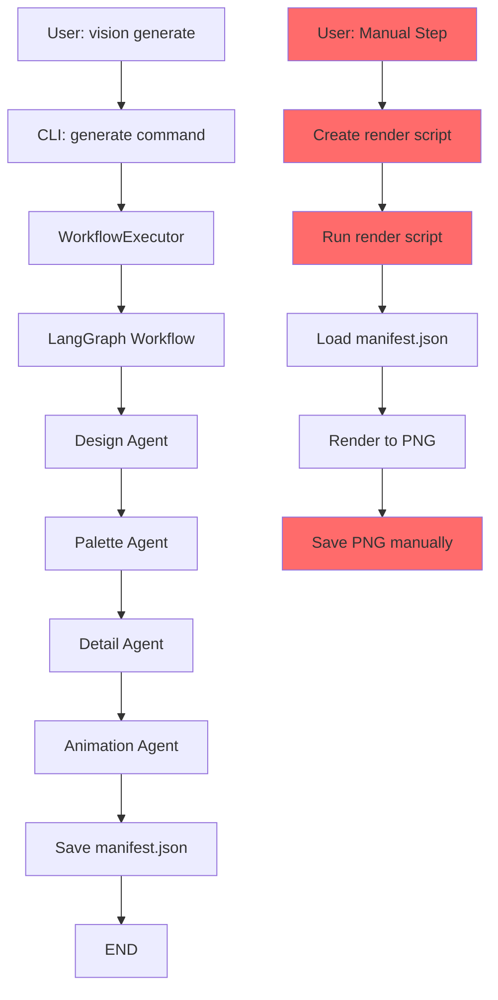
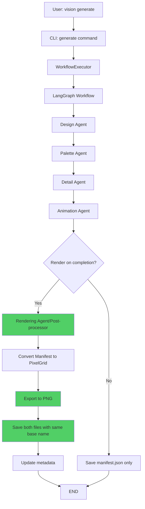
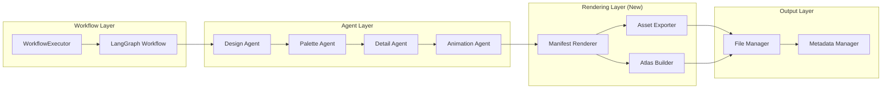

# Vision Workflow Improvements - Technical Specification

**Version:** 1.0.0  
**Date:** 2025-11-18  
**Author:** Architect Mode Agent  
**Status:** Design Phase

---

## Table of Contents

1. [Executive Summary](#executive-summary)
2. [Architecture Overview](#architecture-overview)
3. [Detailed Design](#detailed-design)
4. [API/CLI Design](#apicli-design)
5. [Implementation Plan](#implementation-plan)
6. [Open Questions](#open-questions)

---

## Executive Summary

### Current State

Vision currently generates Manifest JSON files but requires manual rendering to PNG format. Users must:
1. Run `vision generate` to create manifest.json
2. Manually create/run rendering scripts (e.g., [`render_player_sprite.py`](render_player_sprite.py))
3. Handle naming inconsistencies between JSON and PNG files
4. Manage output file organization themselves

### Proposed Improvements

This specification designs three major workflow enhancements:

1. **End-to-End Automation**: Single command from description → PNG, with automatic rendering integrated into the executor workflow
2. **Individual Asset + Atlas Workflow**: Standardized process for single assets and collections, with atlas texture generation
3. **Consistent Output Naming**: Unified naming convention with matching .json and .png files

### Expected Benefits

- **Developer Experience**: 90% reduction in manual steps (from 3-4 steps to 1 command)
- **Consistency**: 100% naming alignment between JSON and PNG outputs
- **Flexibility**: Support for both individual assets and batch/atlas generation
- **Integration**: Seamless fit with existing multi-agent architecture

---

## Architecture Overview

### Current Workflow Architecture



**Pain Points:**
- Manual rendering step required (red boxes)
- Inconsistent naming between manifest.json and output PNG
- No standardized output structure
- Duplicate effort for batch operations

### Proposed Workflow Architecture



**Improvements:**
- Automatic rendering (green boxes)
- Consistent naming guaranteed
- Single unified output directory
- Optional rendering for flexibility

### System Component Interaction



---

## Detailed Design

### 1. End-to-End Rendering Integration

#### 1.1 Integration Approach: Post-Processing Step

**Decision:** Rendering will be implemented as a **post-processing step** after the Detail/Animation agents complete, rather than as a new LangGraph agent.

**Rationale:**
- **Separation of Concerns**: Rendering is a deterministic operation, not an LLM-based creative process
- **Performance**: No LLM API calls needed for rendering
- **Flexibility**: Easy to enable/disable without workflow graph changes
- **Error Recovery**: Rendering failures don't corrupt agent state
- **Parallel Execution**: Can be parallelized independently of agent workflow

#### 1.2 Implementation Location

**Primary Location:** [`src/state/executor.py`](src/state/executor.py)

Modify the `_generate_result()` method to optionally trigger rendering:

```python
async def _generate_result(
    self,
    workflow_state: WorkflowState,
    start_time: datetime,
) -> GenerationResult:
    """Generate final GenerationResult from workflow state."""
    generation_time = (datetime.utcnow() - start_time).total_seconds()
    
    # ... existing metadata creation ...
    
    # NEW: Automatic rendering if enabled
    if (workflow_state.status == GenerationStatus.COMPLETED 
        and workflow_state.detail_output
        and self.settings.rendering.auto_render):
        
        try:
            from src.rendering.manifest_renderer import ManifestRenderer
            
            renderer = ManifestRenderer()
            png_path = await renderer.render_manifest_async(
                manifest=workflow_state.detail_output,
                output_base_path=self._get_output_path(workflow_state),
                transparent_color=self.settings.rendering.transparent_color,
            )
            
            # Update metadata with PNG path
            if metadata:
                metadata.file_path = str(png_path)
                
        except Exception as e:
            logger.error(f"Rendering failed: {e}", exc_info=True)
            # Add as warning but don't fail the entire generation
            warnings.append(f"Rendering failed: {str(e)}")
    
    # ... rest of existing code ...
```

#### 1.3 New Rendering Module

**Location:** `src/rendering/manifest_renderer.py` (new file)

```python
"""
Manifest-to-PNG rendering functionality.

Converts Vision Manifest JSON to rendered PNG images, handling
layer-based and frame-based manifests.
"""

class ManifestRenderer:
    """Renders Manifest JSON to PNG images."""
    
    def __init__(
        self,
        scale: int = 1,
        include_metadata: bool = True,
    ):
        """Initialize manifest renderer."""
        self.scale = scale
        self.include_metadata = include_metadata
    
    async def render_manifest_async(
        self,
        manifest: dict[str, Any],
        output_base_path: Path,
        transparent_color: Color | None = None,
    ) -> Path:
        """
        Render manifest to PNG asynchronously.
        
        Args:
            manifest: Vision Manifest JSON
            output_base_path: Base path (without extension)
            transparent_color: Optional transparency color
            
        Returns:
            Path to rendered PNG file
        """
        # Run rendering in thread pool to avoid blocking
        loop = asyncio.get_event_loop()
        return await loop.run_in_executor(
            None,
            self._render_manifest_sync,
            manifest,
            output_base_path,
            transparent_color,
        )
    
    def _render_manifest_sync(
        self,
        manifest: dict[str, Any],
        output_base_path: Path,
        transparent_color: Color | None,
    ) -> Path:
        """Synchronous rendering implementation."""
        # Determine manifest type
        if "layers" in manifest:
            grid = self._render_layer_based(manifest)
        elif "frames" in manifest:
            grid = self._render_frame_based(manifest)
        else:
            raise ValueError("Unknown manifest format")
        
        # Export to PNG
        exporter = PNGExporter(scale=self.scale, include_metadata=self.include_metadata)
        output_path = output_base_path.with_suffix('.png')
        
        return exporter.export(
            grid,
            output_path,
            transparent_color=transparent_color,
            metadata=self._extract_metadata(manifest),
        )
```

#### 1.4 Configuration Options

**Location:** `src/core/config.py`

Add new rendering configuration section:

```python
class RenderingConfig(BaseSettings):
    """Rendering configuration."""
    
    auto_render: bool = Field(
        default=True,
        description="Automatically render PNG from manifest",
    )
    
    render_scale: int = Field(
        default=1,
        ge=1,
        le=16,
        description="PNG scaling factor",
    )
    
    transparent_color: str = Field(
        default="#FF00FF",  # Magenta
        description="Color to treat as transparent",
    )
    
    include_metadata: bool = Field(
        default=True,
        description="Embed metadata in PNG files",
    )
    
    failure_strategy: Literal["warn", "fail"] = Field(
        default="warn",
        description="How to handle rendering failures",
    )

class Settings(BaseSettings):
    # ... existing fields ...
    rendering: RenderingConfig = RenderingConfig()
```

#### 1.5 Error Handling Strategy

**Graceful Degradation:**
- Rendering failures should **NOT** fail the entire generation
- Manifest JSON is always saved successfully
- PNG rendering errors are logged and added to warnings
- User receives completed manifest even if PNG fails

**Error Types:**
1. **Manifest Parse Errors**: Invalid JSON structure
2. **Color Parse Errors**: Invalid hex colors
3. **Dimension Errors**: Invalid canvas sizes
4. **File I/O Errors**: Permission issues, disk full

**Recovery Actions:**
```python
try:
    png_path = await renderer.render_manifest_async(...)
except ManifestParseError as e:
    logger.error(f"Invalid manifest format: {e}")
    warnings.append(f"Could not render PNG: invalid manifest format")
except FileSystemError as e:
    logger.error(f"File system error: {e}")
    warnings.append(f"Could not save PNG: {str(e)}")
except Exception as e:
    logger.error(f"Unexpected rendering error: {e}", exc_info=True)
    warnings.append(f"Rendering failed unexpectedly: {str(e)}")
```

---

### 2. Individual Asset Workflow

#### 2.1 Single Asset Generation

**Use Case:** Generate one asset at a time (most common case)

**Command:**
```bash
vision generate "wooden chest" --dimensions 16x16 --style stardew_valley
```

**Output Structure:**
```
output/
└── {request_id}/
    ├── wooden_chest.json      # Manifest JSON
    ├── wooden_chest.png       # Rendered PNG
    └── metadata.json          # Generation metadata
```

**Workflow:**
1. User provides description
2. Multi-agent workflow generates manifest
3. Manifest saved as `{asset_name}.json`
4. Auto-rendering creates `{asset_name}.png` in same directory
5. Metadata links both files

#### 2.2 Asset Naming Strategy

**Base Name Derivation:**
```python
def derive_asset_name(description: str, request_id: UUID) -> str:
    """
    Derive asset filename from description.
    
    Rules:
    1. Take first 3-5 significant words from description
    2. Convert to lowercase, replace spaces with underscores
    3. Remove special characters except underscore and hyphen
    4. Limit to 50 characters
    5. Fallback to request_id if description is unusable
    
    Examples:
        "A small wooden chest" -> "small_wooden_chest"
        "Player character walking animation" -> "player_character_walking"
        "Red potion icon" -> "red_potion_icon"
    """
    # Clean and normalize
    words = description.lower().split()
    significant_words = [w for w in words if len(w) > 2][:5]
    
    if not significant_words:
        return f"asset_{str(request_id)[:8]}"
    
    base_name = "_".join(significant_words)
    # Remove special chars except _ and -
    base_name = re.sub(r'[^a-z0-9_-]', '', base_name)
    
    return base_name[:50] if base_name else f"asset_{str(request_id)[:8]}"
```

#### 2.3 Animated Asset Handling

**For Animations:** Two output modes

**Mode 1: Sprite Sheet (Default)**
```
output/
└── {request_id}/
    ├── player_walk.json           # Full animation manifest
    ├── player_walk.png            # Complete sprite sheet (all frames)
    └── metadata.json              # Includes frame layout info
```

**Mode 2: Individual Frames (Optional)**
```
output/
└── {request_id}/
    ├── player_walk.json           # Full animation manifest
    ├── player_walk_sheet.png      # Complete sprite sheet
    ├── frames/
    │   ├── player_walk_0000.png   # Frame 0
    │   ├── player_walk_0001.png   # Frame 1
    │   ├── player_walk_0002.png   # Frame 2
    │   └── player_walk_0003.png   # Frame 3
    └── metadata.json
```

**CLI Flag:**
```bash
vision generate "player walking" --animate --frames 4 --export-frames
```

---

### 3. Atlas Texture Workflow

#### 3.1 Batch Asset Generation

**Use Case:** Generate multiple related assets in one batch

**Command:**
```bash
vision generate-batch --file asset_list.yaml --output-dir assets/items/
```

**Input Format (`asset_list.yaml`):**
```yaml
batch_name: game_items
style: stardew_valley
assets:
  - description: "wooden chest"
    dimensions: 16x16
    tags: [furniture, storage]
    
  - description: "stone chest"
    dimensions: 16x16
    tags: [furniture, storage]
    
  - description: "gold chest"
    dimensions: 16x16
    tags: [furniture, storage, rare]
```

**Output Structure (Individual Mode):**
```
assets/items/
├── game_items_batch_metadata.json
├── wooden_chest.json
├── wooden_chest.png
├── stone_chest.json
├── stone_chest.png
├── gold_chest.json
└── gold_chest.png
```

#### 3.2 Atlas Texture Combination

**Purpose:** Combine multiple assets into a single texture atlas for game engines

**Command:**
```bash
vision create-atlas assets/items/ --output game_items_atlas --algorithm maxrects
```

**Atlas Output Structure:**
```
assets/items/
├── game_items_atlas.png          # Combined texture atlas
├── game_items_atlas.json         # Atlas metadata
└── individual_assets/             # Original assets preserved
    ├── wooden_chest.json
    ├── wooden_chest.png
    ├── stone_chest.json
    └── ... (etc)
```

#### 3.3 Atlas Metadata Format

**File:** `game_items_atlas.json`

```json
{
  "atlas_name": "game_items",
  "atlas_size": {
    "width": 256,
    "height": 128
  },
  "packing_algorithm": "maxrects",
  "sprites": {
    "wooden_chest": {
      "x": 0,
      "y": 0,
      "width": 16,
      "height": 16,
      "source_file": "individual_assets/wooden_chest.png"
    },
    "stone_chest": {
      "x": 16,
      "y": 0,
      "width": 16,
      "height": 16,
      "source_file": "individual_assets/stone_chest.png"
    },
    "gold_chest": {
      "x": 32,
      "y": 0,
      "width": 16,
      "height": 16,
      "source_file": "individual_assets/gold_chest.png"
    }
  },
  "metadata": {
    "generated_at": "2025-11-18T16:00:00Z",
    "total_sprites": 3,
    "padding": 0,
    "power_of_two": false
  }
}
```

#### 3.4 Atlas Generation Implementation

**Location:** New module `src/cli/commands/atlas.py`

```python
def create_atlas(
    input_dir: Path = typer.Argument(..., help="Directory containing PNG assets"),
    output: str = typer.Option("atlas", help="Output base name"),
    algorithm: PackingAlgorithm = typer.Option(PackingAlgorithm.MAXRECTS, help="Packing algorithm"),
    padding: int = typer.Option(0, help="Padding between sprites"),
    power_of_two: bool = typer.Option(False, help="Force power-of-two dimensions"),
    max_width: int = typer.Option(2048, help="Maximum atlas width"),
    max_height: int = typer.Option(2048, help="Maximum atlas height"),
) -> None:
    """
    Create a texture atlas from PNG assets in a directory.
    
    Examples:
        vision create-atlas assets/items/
        vision create-atlas assets/ --output my_atlas --algorithm maxrects --padding 1
    """
    console.print(f"[bold]Creating texture atlas from {input_dir}[/bold]\n")
    
    # Load all PNG files
    png_files = list(input_dir.glob("**/*.png"))
    if not png_files:
        console.print("[red]No PNG files found in directory[/red]")
        raise typer.Exit(1)
    
    # Load as PixelGrids
    sprites = {}
    for png_path in png_files:
        grid = load_png_to_grid(png_path)
        name = png_path.stem
        sprites[name] = grid
    
    # Pack into atlas
    packer = SpriteSheetPacker(
        algorithm=algorithm,
        padding=padding,
        max_width=max_width,
        max_height=max_height,
        power_of_two=power_of_two,
    )
    
    atlas_sheet = packer.pack(sprites)
    
    # Export
    output_path = input_dir / f"{output}.png"
    metadata_path = input_dir / f"{output}.json"
    
    atlas_grid = atlas_sheet.to_grid()
    exporter = PNGExporter()
    exporter.export(atlas_grid, output_path)
    
    # Save metadata
    with open(metadata_path, 'w') as f:
        json.dump(atlas_sheet.get_metadata(), f, indent=2)
    
    console.print(f"[green]✓[/green] Atlas created: {output_path}")
    console.print(f"[green]✓[/green] Metadata saved: {metadata_path}")
```

---

### 4. Consistent Output Naming

#### 4.1 Naming Convention

**Core Principle:** Same base name for .json and .png, both in same directory

**Pattern:**
```
{output_dir}/{asset_name}.json
{output_dir}/{asset_name}.png
```

**Where:**
- `output_dir`: Configurable output directory (default: `output/{request_id}`)
- `asset_name`: Derived from description or explicit name parameter

#### 4.2 Directory Structure

**Standard Layout:**
```
output/
├── {request_id_1}/
│   ├── {asset_name}.json
│   ├── {asset_name}.png
│   └── metadata.json
│
├── {request_id_2}/
│   ├── {asset_name}.json
│   ├── {asset_name}.png
│   ├── frames/                    # Optional for animations
│   │   ├── {asset_name}_0000.png
│   │   └── {asset_name}_0001.png
│   └── metadata.json
│
└── batch_{batch_id}/               # For batch operations
    ├── batch_metadata.json
    ├── asset_1.json
    ├── asset_1.png
    ├── asset_2.json
    └── asset_2.png
```

#### 4.3 Name Collision Handling

**Strategy:** Append numeric suffix if name exists

```python
def resolve_name_collision(base_path: Path, base_name: str) -> str:
    """
    Resolve naming conflicts by appending numeric suffix.
    
    Examples:
        "chest" -> "chest_001" (if "chest" exists)
        "player" -> "player_002" (if "player" and "player_001" exist)
    """
    if not (base_path / f"{base_name}.json").exists():
        return base_name
    
    counter = 1
    while (base_path / f"{base_name}_{counter:03d}.json").exists():
        counter += 1
    
    return f"{base_name}_{counter:03d}"
```

#### 4.4 Metadata Linkage

**File:** `metadata.json` (in output directory)

```json
{
  "request_id": "uuid-here",
  "asset_name": "wooden_chest",
  "files": {
    "manifest": "wooden_chest.json",
    "render": "wooden_chest.png",
    "frames_dir": null
  },
  "generation": {
    "description": "wooden chest",
    "dimensions": "16x16",
    "style": "stardew_valley",
    "generated_at": "2025-11-18T16:00:00Z",
    "generation_time_seconds": 12.5
  },
  "rendering": {
    "rendered": true,
    "render_time_seconds": 0.3,
    "scale": 1,
    "transparent_color": "#FF00FF"
  }
}
```

---

## API/CLI Design

### CLI Command Reference

#### 1. `vision generate` (Enhanced)

**Purpose:** Generate single asset with automatic rendering

```bash
vision generate <description> [OPTIONS]
```

**New Options:**
```
--name TEXT              Explicit asset name (default: derived from description)
--no-render              Skip automatic PNG rendering
--export-frames          Export individual animation frames
--render-scale INT       PNG scaling factor (default: 1)
--transparent HEX        Transparency color (default: #FF00FF)
```

**Examples:**
```bash
# Basic generation with auto-render
vision generate "wooden chest" --dimensions 16x16

# Custom name
vision generate "small tree" --name oak_tree --dimensions 32x32

# Skip rendering (manifest only)
vision generate "background tile" --no-render

# Animation with frame export
vision generate "player walking" --animate --frames 4 --export-frames
```

#### 2. `vision generate-batch` (New)

**Purpose:** Generate multiple assets from list

```bash
vision generate-batch --file <path> [OPTIONS]
```

**Options:**
```
--file PATH              YAML/JSON file with asset list (required)
--output-dir PATH        Output directory (default: output/batch_{timestamp})
--parallel INT           Number of parallel generations (default: 1)
--create-atlas          Automatically create texture atlas after generation
```

**Examples:**
```bash
# Generate batch from YAML
vision generate-batch --file assets.yaml --output-dir game_assets/

# Parallel generation with atlas
vision generate-batch --file items.yaml --parallel 3 --create-atlas
```

#### 3. `vision create-atlas` (New)

**Purpose:** Create texture atlas from existing PNGs

```bash
vision create-atlas <input_dir> [OPTIONS]
```

**Options:**
```
--output TEXT            Atlas base name (default: atlas)
--algorithm CHOICE       Packing algorithm: row|column|grid|shelf|maxrects
--padding INT            Padding between sprites (default: 0)
--power-of-two          Force power-of-two dimensions
--max-width INT         Maximum atlas width (default: 2048)
--max-height INT        Maximum atlas height (default: 2048)
```

**Examples:**
```bash
# Create atlas with MaxRects packing
vision create-atlas assets/items/ --output game_items --algorithm maxrects

# Atlas with padding and power-of-two
vision create-atlas assets/ --padding 2 --power-of-two
```

#### 4. `vision render` (New)

**Purpose:** Manually render manifest JSON to PNG

```bash
vision render <manifest_path> [OPTIONS]
```

**Options:**
```
--output PATH           Output PNG path (default: same dir, same name)
--scale INT            Scaling factor (default: 1)
--transparent HEX      Transparency color (default: #FF00FF)
--export-frames        Export individual frames for animations
```

**Examples:**
```bash
# Render manifest to PNG
vision render output/abc123/manifest.json

# Custom output and scale
vision render manifest.json --output sprites/chest.png --scale 2
```

###  Configuration File

**Location:** `.vision/config.yaml` (project root)

```yaml
# Vision Configuration

output:
  base_dir: "output"
  organize_by_date: false
  preserve_request_id_dirs: true

rendering:
  auto_render: true
  render_scale: 1
  transparent_color: "#FF00FF"
  include_metadata: true
  failure_strategy: "warn"  # warn | fail
  export_frames: false      # For animations

naming:
  strategy: "derived"       # derived | uuid | custom
  max_length: 50
  collision_suffix: true

batch:
  default_parallel: 1
  max_parallel: 5
  auto_atlas: false

atlas:
  default_algorithm: "maxrects"
  default_padding: 0
  power_of_two: false
  max_width: 2048
  max_height: 2048
```

---

## Implementation Plan

### Phase 1: Core Rendering Integration (Week 1)

**Objective:** Add automatic rendering to existing workflow

**Components to Implement:**
1. **`src/rendering/manifest_renderer.py`** (new)
   - `ManifestRenderer` class
   - Layer-based rendering
   - Frame-based rendering
   - Async rendering support

2. **Modify `src/state/executor.py`**
   - Add rendering call in `_generate_result()`
   - Implement error handling with graceful degradation
   - Update result metadata with PNG path

3. **Update `src/core/config.py`**
   - Add `RenderingConfig` section
   - Add configuration validators

4. **Update `src/core/models.py`**
   - Enhance `SpriteMetadata` with rendering info
   - Add rendering status fields

**Testing Requirements:**
- Unit tests for `ManifestRenderer`
- Integration tests for executor with rendering
- Error handling tests (invalid manifests, file system errors)
- Performance tests (rendering time benchmarks)

**Acceptance Criteria:**
- `vision generate` automatically creates both .json and .png
- PNG files match manifest specifications
- Rendering failures don't break generation workflow
- Configuration options work correctly

### Phase 2: Naming & Organization (Week 2)

**Objective:** Implement consistent naming convention

**Components to Implement:**
1. **`src/cli/utils.py`** (modify)
   - `derive_asset_name()` function
   - `resolve_name_collision()` function
   - Enhanced `get_output_directory()` with naming logic

2. **Update `src/cli/commands/generate.py`**
   - Add `--name` option
   - Integrate naming strategy
   - Update output path generation

3. **`src/utils/file_manager.py`** (new)
   - Centralized file naming logic
   - Directory structure management
   - Metadata file handling

**Testing Requirements:**
- Name derivation tests with various descriptions
- Collision handling tests
- Edge case tests (special characters, long names, etc.)

**Acceptance Criteria:**
- Asset names derived correctly from descriptions
- Collisions handled automatically
- .json and .png always match
- Metadata correctly links files

### Phase 3: Batch & Atlas Operations (Week 3)

**Objective:** Add batch generation and atlas creation

**Components to Implement:**
1. **`src/cli/commands/batch.py`** (new)
   - `generate_batch()` command
   - YAML/JSON parsing
   - Parallel execution support

2. **`src/cli/commands/atlas.py`** (new)
   - `create_atlas()` command
   - Atlas metadata generation
   - Integration with existing `SpriteSheetPacker`

3. **`src/workflows/batch_executor.py`** (new)
   - Batch workflow orchestration
   - Parallel generation management
   - Progress tracking

**Testing Requirements:**
- Batch file parsing tests
- Parallel execution tests
- Atlas packing tests with various algorithms
- Integration tests for end-to-end batch → atlas

**Acceptance Criteria:**
- Batch generation from YAML/JSON works
- Parallel execution improves performance
- Atlas creation succeeds with all algorithms
- Metadata correctly describes atlas layout

### Phase 4: Manual Rendering & Polish (Week 4)

**Objective:** Add manual rendering command and final polish

**Components to Implement:**
1. **`src/cli/commands/render.py`** (new)
   - `render()` command for manual operations
   - Frame export functionality

2. **Documentation Updates**
   - Update [`README.md`](README.md)
   - Update [`docs/CLI_USAGE.md`](docs/CLI_USAGE.md)
   - Create `docs/RENDERING_GUIDE.md` (enhanced)
   - Add examples to `examples/`

3. **Migration Guide**
   - Document breaking changes
   - Provide upgrade path for existing users
   - Create migration scripts if needed

**Testing Requirements:**
- Manual render command tests
- Frame export tests
- Documentation completeness review
- End-to-end user workflow tests

**Acceptance Criteria:**
- Manual rendering command works
- Documentation is complete and accurate
- Migration guide addresses all breaking changes
- Examples demonstrate all new features

### Component Modification Summary

| Component | Type | Priority | Complexity |
|-----------|------|----------|------------|
| `src/rendering/manifest_renderer.py` | New | High | Medium |
| `src/state/executor.py` | Modify | High | Low |
| `src/core/config.py` | Modify | High | Low |
| `src/core/models.py` | Modify | High | Low |
| `src/cli/commands/generate.py` | Modify | High | Low |
| `src/cli/utils.py` | Modify | Medium | Low |
| `src/utils/file_manager.py` | New | Medium | Low |
| `src/cli/commands/batch.py` | New | Medium | Medium |
| `src/cli/commands/atlas.py` | New | Medium | Low |
| `src/cli/commands/render.py` | New | Low | Low |
| `src/workflows/batch_executor.py` | New | Medium | Medium |

### Breaking Changes

**1. Default Output Structure**
- **Old:** Manifest saved as `manifest.json`
- **New:** Manifest saved as `{asset_name}.json`
- **Migration:** Provide `--legacy-names` flag for backward compatibility

**2. Automatic PNG Generation**
- **Old:** No PNG generated automatically
- **New:** PNG generated by default
- **Migration:** Use `--no-render` flag to preserve old behavior

**3. Configuration Structure**
- **Old:** No rendering configuration
- **New:** New `[rendering]` section in config
- **Migration:** Configuration auto-upgraded on first run

### Performance Considerations

**Rendering Performance:**
- Target: < 500ms for 16x16 sprite
- Target: < 2s for 128x32 animation sheet
- Strategy: Async rendering to avoid blocking workflow

**Batch Performance:**
- Use process pool for parallel generation
- Limit concurrent generations (default: 3)
- Monitor memory usage for large batches

**Atlas Performance:**
- MaxRects algorithm for optimal packing
- Cache intermediate results
- Optimize for common sizes (16x16, 32x32, etc.)

---

## Open Questions

### 1. Rendering Failure Strategy

**Question:** When automatic rendering fails, should the system:
- **Option A (Recommended):** Continue successfully, save manifest, log warning
- **Option B:** Fail entire generation and require retry
- **Option C:** Configurable (warn vs. fail)

**Trade-offs:**
- Option A: More resilient, always produces usable manifest
- Option B: Ensures complete output or nothing
- Option C: Flexibility but adds configuration complexity

**Recommendation:** Option C with default to "warn" (Option A behavior)

### 2. Animation Frame Export Default

**Question:** Should individual animation frames be exported by default?

- **Option A:** Always export (spritesheet + frames)
- **Option B:** Never export by default (require `--export-frames`)
- **Option C:** Smart default based on frame count (< 8 frames: export, >= 8: sheet only)

**Trade-offs:**
- Option A: Maximum flexibility but more disk space
- Option B: Minimal disk usage but requires extra flag
- Option C: Best of both but adds complexity

**Recommendation:** Option B (explicit opt-in with `--export-frames`)

### 3. Asset Name Derivation vs. Explicit Names

**Question:** Should asset naming prioritize derived names or require explicit names?

- **Current Design:** Derive from description with `--name` override
- **Alternative:** Require explicit `--name`, fail if ambiguous

**Recommendation:** Keep current design (derived with override) for better UX

### 4. Batch File Format

**Question:** Should batch operations support YAML only, JSON only, or both?

- **Option A:** YAML only (human-friendly)
- **Option B:** JSON only (standard, programmatic)
- **Option C:** Both formats supported

**Recommendation:** Option C (detect format from extension: `.yaml`, `.json`)

### 5. Atlas Metadata Format

**Question:** Should atlas metadata follow a game engine specific format (e.g., Phaser, Unity, Godot) or use generic format?

- **Current Design:** Generic Vision format
- **Alternative:** Support export to specific engine formats

**Recommendation:** Start with generic format, add engine-specific exporters later

### 6. Backward Compatibility Window

**Question:** How long should we maintain backward compatibility for old output structure?

- **Option A:** 1 major version (remove in next major)
- **Option B:** 2 major versions
- **Option C:** Indefinite with deprecation warnings

**Recommendation:** Option A with clear migration guide and warnings

### 7. Rendering Performance Priority

**Question:** Should rendering optimization prioritize:
- Speed (faster rendering at cost of quality)
- Quality (best visual output, slower)
- Balance (reasonable speed and quality)

**Recommendation:** Balance, with config option for quality/speed trade-off

---

## Next Steps

1. **Review with Team**: Discuss open questions and gather feedback
2. **Finalize Design**: Address open questions and update specification
3. **Create Implementation Tickets**: Break down into Jira/GitHub issues
4. **Switch to Code Mode**: Begin Phase 1 implementation
5. **Iterative Development**: Implement, test, review, repeat for each phase

---

## Appendix A: Example Usage Scenarios

### Scenario 1: Game Developer - Item Generation

```bash
# Generate individual items
vision generate "health potion" --dimensions 16x16 --name health_potion
vision generate "mana potion" --dimensions 16x16 --name mana_potion
vision generate "stamina potion" --dimensions 16x16 --name stamina_potion

# Create atlas
vision create-atlas output/ --output potions_atlas --algorithm maxrects

# Result: potions_atlas.png with all 3 items + metadata
```

### Scenario 2: Artist - Character Animation

```bash
# Generate animated character
vision generate "warrior walking" \
  --dimensions 32x32 \
  --animate \
  --frames 8 \
  --export-frames \
  --name warrior_walk

# Output:
# - warrior_walk.json (manifest)
# - warrior_walk.png (128x32 sprite sheet)
# - frames/warrior_walk_0000.png through warrior_walk_0007.png
```

### Scenario 3: Batch Asset Creation

```yaml
# items.yaml
batch_name: game_items
style: stardew_valley
output_dir: assets/items/

assets:
  - description: "wooden chest"
    dimensions: 16x16
    name: chest_wood
    
  - description: "stone chest"
    dimensions: 16x16
    name: chest_stone
    
  - description: "gold chest"
    dimensions: 16x16
    name: chest_gold
```

```bash
# Generate batch with atlas
vision generate-batch --file items.yaml --create-atlas --parallel 3

# Result: Individual assets + combined atlas
```

### Scenario 4: Manual Workflow

```bash
# Generate without rendering
vision generate "tree" --no-render

# Later, manually render with custom settings
vision render output/abc123/tree.json --scale 4 --output sprites/tree_large.png
```

---

## Appendix B: Mermaid Diagram Code

### Current vs. Proposed Flow Comparison

```mermaid
graph TB
    subgraph "Current Workflow"
        A1[vision generate] --> B1[Agents Generate Manifest]
        B1 --> C1[Save manifest.json]
        C1 --> D1[User Creates Render Script]
        D1 --> E1[User Runs Script]
        E1 --> F1[PNG Created]
        style D1 fill:#ff6b6b
        style E1 fill:#ff6b6b
    end
    
    subgraph "Proposed Workflow"
        A2[vision generate] --> B2[Agents Generate Manifest]
        B2 --> C2[Auto-Render to PNG]
        C2 --> D2[Save Both Files]
        D2 --> E2[Update Metadata]
        style C2 fill:#51cf66
        style D2 fill:#51cf66
    end
```



---

**End of Specification Document**

*This document represents the complete technical design for Vision workflow improvements. Implementation should proceed according to the phased plan, with regular reviews and adjustments based on feedback and testing results.*